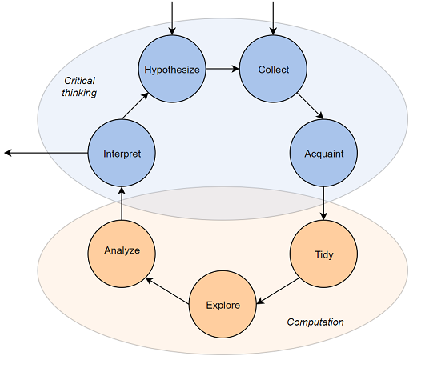

## Week 2a: Intro to Data Science

Data Science Lifecycle

Working with tabular data

Data visualization

. . . 

Python Jupyter notebooks using *pandas* and *seaborn*

Goal is to be hands-on

Much of the material is borrowed/distilled  from PSTAT 100 notes courtesy of Trevor Ruiz

## What is data science?

```{python}
#| echo: false
#| slideshow: {slide_type: skip}
import pandas as pd
import numpy as np
import altair as alt
import IPython.display as display
```

Data science encompasses a wide range of activities that involve *uncovering insights from quantitative information*.

. . .

People that refer to themselves as **data scientists** typically combine specific interests ("domain knowledge", *e.g.*, biology) with computation, mathematics, and statistics and probability to contribute to knowledge in their communities.

* Intersectional in nature
* No singular disciplinary background among practitioners

## Data science lifecycle

> Data science **lifecycle**: *an end-to-end process resulting in a data analysis product*

* Question formulation
* Data collection and cleaning
* Exploration
* Analysis


These form a *cycle* in the sense that the steps are iterated for question refinement and futher discovery. 

## Data science lifecycle




The point isn't really the exact steps, but rather the notion of an iterative process.

> **-> Pandas basics in Google Colab/Jupyter**

## Starting with a question

The scaling of brains with bodies is thought to contain clues about evolutionary patterns pertaining to intelligence. 

. . .

There are lots of datasets out there with brain and body weight measurements, so let's consider the question: 

> *What is the relationship between an animal's brain and body weight?*

## Data acquisition

Allison *et al.* 1976 provide average body and brain weights for 62 mammals:

```{python}
#| scrolled: true
#| slideshow: {slide_type: '-'}
# import brain and body weights
bb_weights = pd.read_csv('../../datasets/allison1976.csv').iloc[:, 0:3]
bb_weights.head(3)
```

**Units of measurement**

* body weight in kilograms
* brain weight in grams

## Data assessment

How well-matched is the data to our question?

* Mammals only (no birds, fish, reptiles, etc.)
* Species are those for which convenient specimens were available
* Averages across specimens are reported ('aggregated' data)


## Data assessment

Based on the great points you just made, we really only stand to learn something about this **particular** sample of animals.

. . .

In other words, no *inference* is possible. 

> Do you think the data are still useful?

## Inspection

This dataset is already impeccably neat: each row is an observation for some species of mammal, and the columns are the two variables (average weight). 

So no tidying needed -- we'll just check the dimensions and see if any values are missing.

```{python}
#| echo: true 
# dimensions?
bb_weights.shape
```

```{python}
#| echo: true 
# missing values?
bb_weights.isna().sum(axis = 0)
```

## Exploration

Visualization is usually a good starting point for exploring data.

```{python}
# plot
alt.Chart(bb_weights).mark_point().encode(x = 'body_wt', y = 'brain_wt')
```

The few outliers skew the visuals so that we cannot discern the big clump around $(0, 0)$ -- that suggests we shouldn't look for a relationship on the scale of kg/g.

## Exploration

A simple **log-log transformation** of the axes reveals a clearer pattern.

```{python}
# plot
alt.Chart(bb_weights).mark_point().encode(
    x = alt.X('body_wt', scale = alt.Scale(type = 'log'), title = 'body weight (kg)'),
    y = alt.Y('brain_wt', scale = alt.Scale(type = 'log'), title = 'brain weight (g)')
)
```

## Analysis

The plot shows us that there's a roughly **linear** relationship on the log scale:

$$\log(\text{brain}) = \alpha \log(\text{body}) + c$$

. . .

So what does that mean in terms of brain and body weights? A little algebra gives us a "power law":

$$(\text{brain}) \propto (\text{body})^\alpha$$ 


Check your understanding: what's the proportionality constant?

## Interpretation

So it appears that the brain-body scaling is well-described by a **power law**:

> among selected specimens of these 62 species of mammal, species average brain weight is approximately proportional to a power of species average body weight

Compare to poorly worded versions like:

- animals' brains are proportional to a power of their bodies
- among these 62 mammals, average brain weight is approximately proportional to a power of average body weight [the average is per species not across all mammals]

. . .  

Question **refinement**: we can now ask further, more specific questions:

> Do other types of animals exhibit the same power law relationship? 


## More data acquisition

To investigate, we need richer data.

A number of authors have compiled and published 'meta-analysis' datasets by combining the results of multiple studies.

Below we import a few of these for three different animal classes.

```{python}
#| echo: true
# import metaanalysis datasets
reptiles = pd.read_csv('../../datasets/reptile_meta.csv')
birds = pd.read_csv('../../datasets/bird_meta.csv', encoding = 'latin1')
mammals = pd.read_csv('../../datasets/mammal_meta.csv', encoding = 'latin1')
```

## Data assessment

Where does this data come from? It's kind of a convenience sample of scientific data:

* Multiple studies $\rightarrow$ possibly different sampling and measurement protocols
* Criteria for inclusion unknown $\rightarrow$ probably neither comprehensive nor representative of all such measurements taken


So these data, while richer, are still relatively narrow in terms of generalizability.

```{python}
#| slideshow: {slide_type: skip}
# variables of interest
rept_vars = reptiles.columns[[0, 1, 2, 3, 7, 9, 11]].tolist()
bird_vars = birds.columns[[0, 1, 2, 3, 6, 11, 10]].tolist()
mammal_vars = mammals.columns[[0, 1, 2, 3, 6, 14, 11]].tolist()

# rename columns to consistent names
rept = reptiles.loc[:, rept_vars].rename(columns = {'Body weight (g)': 'body',
                                             'Brain weight (g)': 'brain'})

bird = birds.loc[:, bird_vars].rename(columns = {'Body mass (g)': 'body',
                                           'Brain mass (g)': 'brain'})

mamm = mammals.loc[:, mammal_vars].rename(columns = {'Body mass (g)': 'body',
                                           'Brain mass (g)': 'brain'})

# add animal indicator
mamm['class'] = 'Mammal'
bird['class'] = 'Bird'
rept['class'] = 'Reptile'

# concatenate
frames = [rept, mamm, bird]
data = pd.concat(frames)
```

. . . 

Cannot do general inferences (*e.g.*, to all animals, all mammals, etc.) because they weren't collected for the purpose to which we're putting them.


Usually, if data are not collected for the explicit purpose of the question you're trying to answer, they won't constitute a **representative** sample.


## Inspection

This dataset has quite a lot of **missing** brain weight measurements: many of the underlying studies combined to form these datasets did not include that particular measurement.

```{python}
#| echo: true
# missing values?
data.isna().mean(axis = 0)
```


```{python}
#| slideshow: {slide_type: skip}
# aggregate by species
avg_weights = data.dropna().groupby(['class', 'Order', 'Family', 'Genus', 'Species', 'Sex']).mean().reset_index()
avg_weights['log(body)'] = np.log(avg_weights['body'])
avg_weights['log(brain)'] = np.log(avg_weights['brain'])
```

## Exploration

Focusing on the non-missing values, we see the same power law relationship but with *different* proportionality constants and exponents for the three classes of animals.

```{python}
#| slideshow: {slide_type: skip}
scatter = alt.Chart(avg_weights).mark_point(opacity = 0.2).encode(
    x = 'log(body)',
    y = 'log(brain)',
    color = 'class'
).properties(width=600,height=270)

trend = scatter.transform_regression('log(body)', 'log(brain)', groupby = ['class']).mark_line(size = 2)
```

```{python}
scatter + trend
```

So we might hypothesize that:

$$
(\text{brain}) = \beta_1(\text{body})^{\alpha_1} \qquad \text{(mammal)} \\
(\text{brain}) = \beta_2(\text{body})^{\alpha_2} \qquad \text{(reptile    )} \\
(\text{brain}) = \beta_3(\text{body})^{\alpha_3} \qquad \text{(bird        )}
$$ 


## Interpretation

It seems that the average brain and body weights of the birds, mammals, and reptiles measured in these studies exhibit distinct power law relationships.

$$\beta_i \neq \beta_j, \quad \alpha_i \neq \alpha_j \quad \text{for } i \neq j
$$


What would you be interested in investigating next?

. . . 

- Correlates of body weight?
- Adjust for lifespan, habitat, predation, etc.?
- Estimate the $\alpha_i$'s and $\beta_i$'s?
- Predict brain weights for unobserved species?

## A comment

_**Notice that the word 'model' is never mentioned**_ 

. . .

This was intentional --- it is a common misconception that analyzing data always involves fitting models.

* Models are not not always necessary or appropriate
* You can learn a lot from exploratory techniques
* Models approximate specific kinds of relationships in data
* Exploratory analysis can reveal unexpected structure


## Zooming out: the Data Lifecycle

This example illustrates the aspects of the lifecycle:

* data retrieval and import
* tidying and transformation
* visualization
* exploratory analysis
* modeling


## History of Data Science 

-   Data science emerged as a term of art in the last decade

-   Interest exploded in the last five years


Origins: 'data analysis': In 1960s Tukey advocated for 'data analysis' as a broader field than statistics:

-   statistical theory and methodology;

  -   visualization and data display techniques;

-   computation and scalability;

-   breadth of application.


Tukey's 'data analysis' is proto-modern data science. In the 1960's and 1970's:

-   visualization meant ***drawing***

-   computation meant ***data re-expression by hand***


## Confirmatory approach

The "confirmatory" approach of the classical inferential framework.

```{dot}
//| fig-height: 3.3
digraph confirm {
  
  layout = dot
  rankdir = LR
  fontname = "sans-serif"
  fontsize = "20pt"
  
  node [
      shape = rectangle,
      fontsize = "20pt",
      fontname = "sans-serif"
      ]

  sci [
    label = "domain \lknowledge", 
    shape = ellipse
    ]
  
  subgraph cluster_1{
    color = white
    
    hyp [label = "hypotheses"]
    exp [label = "designed \lexperiment"]
    
    label = "data generation"
  }
  
  subgraph cluster_2 {
    color = white
    
    mdl [label = "statistical \lmodel"]
    dat [label = "data"]
    
    label = "data analysis"
  }
  
  subgraph cluster_3 {
    color = white
    node [shape = ellipse]
    
    yay [label = "supporting \levidence"]
    nay [label = "opposing \levidence"]
    
    label = "decision"
  }
  sci -> hyp
  hyp -> exp
  exp -> dat
  exp -> mdl
  dat -> yay
  dat -> nay
  mdl -> yay
  mdl -> nay

}
```

-   statistical model determined by experimental design

-   analysis based on statistical theory. 

-   output is a decision


## Early data analysis concepts


The new techniques allowed for ***iterative*** investigation:

-   formulate a question

-   examine data graphics and summaries

-   adjust computations and graphics to hone in on content of interest

-   refine the question

From 1960-2010, adopters of the 'data analysis as a field' view were largely industry practitioners.
Their ideas evolved into an alternative approach:

-   data-driven rather than theory-driven;

-   iterative rather than conclusive.

-   In the meantime, computer scientists advanced the field of machine learning


## Exploratory approach

Iterative problem-solving together with applied machine learning was codified into an academic discipline in the early 21st century.


The "exploratory" approach of iterative modern data analysis.

```{dot}
//| fig-height: 3.3

digraph explore {
  layout = dot
  rankdir = LR
  fontname = "sans-serif"
  fontsize = "20pt"
  
  node [
      shape = rectangle,
      fontsize = "20pt",
      fontname = "sans-serif"
      ]
      
  sci [
    label = "domain \lknowledge",
    shape = ellipse
    ]
  
  subgraph cluster_1 {
    color = white
    label = "data analysis"
    
    q [label = "question \lformulation"]
    dat [label = "data"]
    mdl [label = "statistical \lmodel"]
    
    q -> dat [style = "bold", color = "red"]
    dat -> mdl [style = "bold", color = "red"]
    mdl -> q [style = "bold", color = "red"]
    
  }
  
  subgraph cluster_2 {
    label = "findings"
    color = white
    
    node [shape = ellipse]
    edge [style = invis]
    
    f1 [label = "finding 1"]
    f2 [label = "finding 2"]
    dots [label = "&#8942;", color = white]
    
  }
    
    sci -> q
    mdl -> {f1 f2}
}

```

-   outputs are findings

-   statistical model determined by data

-   analysis techniques include empirical methods

## Drivers of change

In the 2000s and especially after 2010, the iterative approach enjoys broader applicability than it used to:

-   due to automated and/or scalable data collection

    -   observational data is widely available across domains

    -   and includes large numbers of variables

-   highly specialized data problems evade methodology with theoretical support

-   more accessible to analysts without advanced statistical training

-  Machine learning advanced modern **predictive modeling**, most notably in the past 15 years:

    -   neural networks and deep learning

    -   optimization

    -   algorithmic analysis


## Structuring Data

Usually work with **tabular data**:  Many ways to structure a dataset according to

1. Rows
2. Columns
3. Number of tables


Because of the wide range of possible layouts for a dataset, and the variety of choices that are made about how to store data, **data scientists are constantly faced with determining how best to reorganize datasets in a way that facilitates exploration and analysis.** 

Next class: **tidy data format** and basics of **dataframes** in pandas

