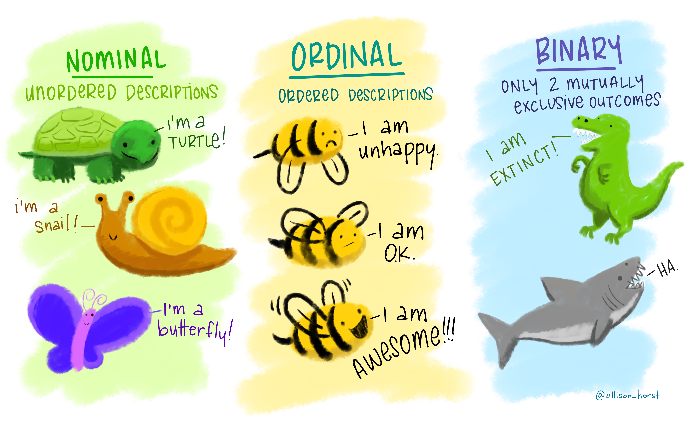
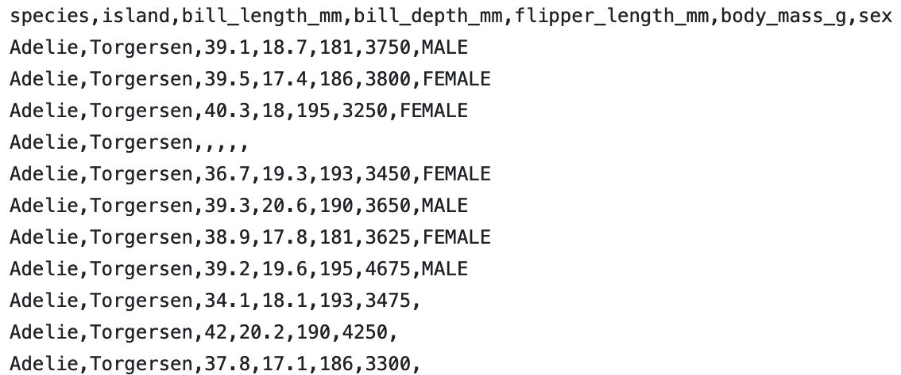
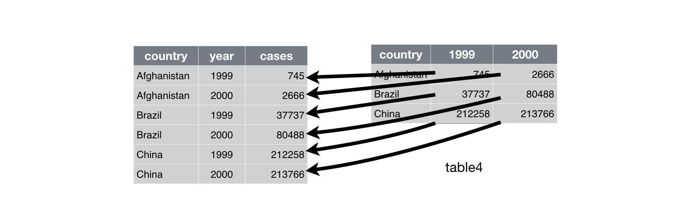
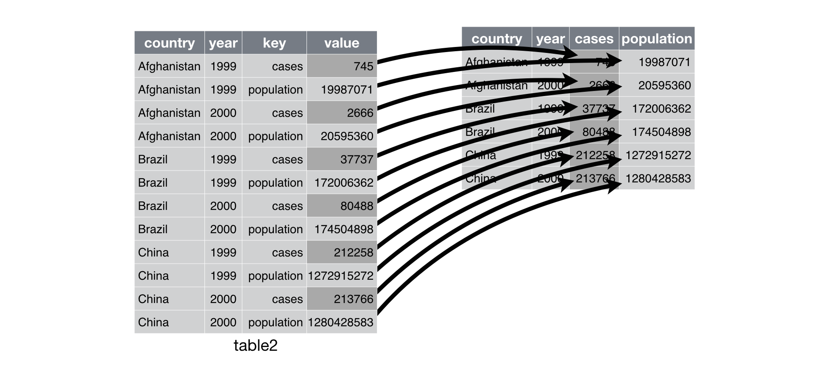
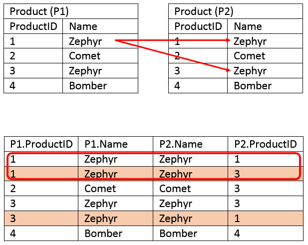

```{python}
#| echo: false
#| slideshow: {slide_type: skip}
import pandas as pd
import numpy as np
import altair as alt
import IPython.display as display
```

## Plan for Today: Tidy Data

- Data Science Lifecycle

- __Working with tabular data__

- Data visualization


## History of Data Science 

-   Data science emerged as a term of art in the last decade

-   Interest exploded in the last five years


Origins: 'data analysis': In 1960s Tukey advocated for 'data analysis' as a broader field than statistics:

-   statistical theory and methodology;

  -   visualization and data display techniques;

-   computation and scalability;

-   breadth of application.


Tukey's 'data analysis' is proto-modern data science. In the 1960's and 1970's:

-   visualization meant ***drawing***

-   computation meant ***data re-expression by hand***


## Confirmatory approach

The "confirmatory" approach of the classical inferential framework.

```{dot}
//| fig-height: 3.3
digraph confirm {
  
  layout = dot
  rankdir = LR
  fontname = "sans-serif"
  fontsize = "20pt"
  
  node [
      shape = rectangle,
      fontsize = "20pt",
      fontname = "sans-serif"
      ]

  sci [
    label = "domain \lknowledge", 
    shape = ellipse
    ]
  
  subgraph cluster_1{
    color = white
    
    hyp [label = "hypotheses"]
    exp [label = "designed \lexperiment"]
    
    label = "data generation"
  }
  
  subgraph cluster_2 {
    color = white
    
    mdl [label = "statistical \lmodel"]
    dat [label = "data"]
    
    label = "data analysis"
  }
  
  subgraph cluster_3 {
    color = white
    node [shape = ellipse]
    
    yay [label = "supporting \levidence"]
    nay [label = "opposing \levidence"]
    
    label = "decision"
  }
  sci -> hyp
  hyp -> exp
  exp -> dat
  exp -> mdl
  dat -> yay
  dat -> nay
  mdl -> yay
  mdl -> nay

}
```

-   statistical model determined by experimental design

-   analysis based on statistical theory. 

-   output is a decision


## Early data analysis concepts


The new techniques allowed for ***iterative*** investigation:

-   formulate a question

-   examine data graphics and summaries

-   adjust computations and graphics to hone in on content of interest

-   refine the question

From 1960-2010, adopters of the 'data analysis as a field' view were largely industry practitioners.
Their ideas evolved into an alternative approach to working with data:

-   data-driven rather than theory-driven;

-   iterative rather than conclusive.

-   In the meantime, computer scientists advanced the field of machine learning


## Exploratory approach

Iterative problem solving together with applied machine learning was codified in an academic discipline only in the 21st century


The "exploratory" approach of iterative modern data analysis.

```{dot}
//| fig-height: 3.3

digraph explore {
  layout = dot
  rankdir = LR
  fontname = "sans-serif"
  fontsize = "20pt"
  
  node [
      shape = rectangle,
      fontsize = "20pt",
      fontname = "sans-serif"
      ]
      
  sci [
    label = "domain \lknowledge",
    shape = ellipse
    ]
  
  subgraph cluster_1 {
    color = white
    label = "data analysis"
    
    q [label = "question \lformulation"]
    dat [label = "data"]
    mdl [label = "statistical \lmodel"]
    
    q -> dat [style = "bold", color = "red"]
    dat -> mdl [style = "bold", color = "red"]
    mdl -> q [style = "bold", color = "red"]
    
  }
  
  subgraph cluster_2 {
    label = "findings"
    color = white
    
    node [shape = ellipse]
    edge [style = invis]
    
    f1 [label = "finding 1"]
    f2 [label = "finding 2"]
    dots [label = "&#8942;", color = white]
    
  }
    
    sci -> q
    mdl -> {f1 f2}
}

```

-   outputs are findings

-   statistical model determined by data

-   analysis techniques include empirical methods

## Drivers of change

In the 2000s and especially after 2010, the iterative approach enjoys broader applicability than it used to:

-   due to automated and/or scalable data collection

    -   observational data is widely available across domains

    -   and includes large numbers of variables

-   highly specialized data problems evade methodology with theoretical support

-   more accessible to analysts without advanced statistical training

-  Machine learning advanced modern **predictive modeling**, most notably in the past 15 years:

    -   neural networks and deep learning

    -   optimization

    -   algorithmic analysis


## What is research?

Research is *systematic investigation* undertaken in order to establish or discover facts.


What are facts in data science?

-   method *M* outperforms method *M'* at task *T*

-   we analyzed data *D* and reached the conclusion that...

__The research landscape:__

Formal communities -- *i.e.,* journals, departments, conferences -- are still coalescing around data science research.

Relevant research largely occurs in statistics, computer science, and application domains, and can be divided broadly into:

-   methodology -- creating new techniques to analyze data

-   applications -- applying existing methods to generate new findings

## Methodological vs Applied research

Methodological research might involve:

-   designing a faster algorithm for solving a particular problem

-   proposing a new technique for analyzing a particular type of data

-   generalizing a technique to a broader range of problems


Applied research might involve:

-   analyzing a specific dataset or producing a novel analysis of existing data

-   creating ad-hoc methods for a domain-specific problem

-   importing methodology from another area to bear on a domain-specific problem

## What is data? 

Data can be any unprocessed fact, value, text, sound file, image, video,..

Examples:

- your homework files
- photos 
- each click on a website
- each transation at your bank, credit card, grocery store


## Types of Statistical Data

<!--
## Data Terminology

Data cames in numerous types and formats and impacts the data science life cycle stages: 

- Data Preparation 
- Statistical methods and tools to use in data analysis
- Insights and conclusions that can be drawn. 

You can't add number and character
--> 
Type of data determines the analysis or models you can use 

 **Quantitative or numeric:** Numeric information <!-- Data expressed in numbers ht, wt, age -->

- Example: height, weight, age, GPA<!-- eg. bill_length_mm, flipper_length_mm --> 
- can use math functions eg. average, max, min, sum
- not everything represented by a number is a quantitative/numeric variable
    - Zipcode, StudentID


**Qualitative or categorical:** descriptions (usually words)  
<!-- Data that maybe separated  in groups, categories favorite sport, eye color, state of residence -->

- Example: Eye color, state of residence,  <!-- eg. species, island, sex --> 
- can't use math functions
- categorical variables have **levels**

##  Types of Numerical data


- **Discrete** : data that can be counted and therefore can take on only certain values
    - eg. shoe size, number of questions answered correctly
    
- **Continuous** : data that is measured on an infinite scale
    - eg. Height, weight, temperature
    
{height=4in}
    
##  Types of Categorical data

- **Ordinal ** : data that can be ordered or data on a scale
    - eg. income (low, medium, high)
    

- **Nominal** : data with no apparent order to it
    - e.g. gender 


{height=4in}


## Practice: Identify the type of data

- Age : 12, 13, 17 years old
    
###

- Spice level: mild, medium, hot
    
###

- Temperature: 77.5 , 80.2, 73
    
###

- Eye color: green, blue, brown, black


## Structure or format of data

What is a dataset?

**A dataset is any collection of data**

Typically, a dataset contains data in tabular  form: 

- **Variables** across the columns
- **Observations** or data points down the rows

In Python, a good intution is that datasets are dictionaries

<!--
- Rows of data points or observations
- Columns of variables representing a category, a number, true/false etc
--> 

## What does data _look like_ ?   Where is the dataset?

- generally a .csv file



## Load a data frame

-  A .csv file can be loaded as a data frame.


## Structuring Data

* **Tabular data**
    + Many ways to structure a dataset
    + Rows and columns

* **Tidy data: matching semantics with structure**
    + Data semantics: observations and variables
    + The tidy standard

* **Transforming data frames**
    + Subsetting (slicing and filtering)
    + Derived variables
    + Aggregation and summary statistics

## Tabular data

* Many possible layouts for tabular data
* 'Real' datasets have few organizational constraints

Most data are stored in tables, but **there are always multiple possible tabular layouts for the same underlying data**.


## Mammal data: long layouts

Below is the Allison 1976 mammal brain-body weight dataset  shown in two '**long**' layouts: 

```{python}
#| slideshow: {slide_type: skip}
#| tags: []
# import brain and body weights
mammal1 = pd.read_csv('../../datasets/allison1976.csv').iloc[:, 0:3].set_index('species')

mammal2 = mammal1.melt(
    var_name = 'measurement', 
    value_name = 'weight', 
    value_vars = ['brain_wt', 'body_wt'],
    ignore_index = False
).sort_index()

mammal3 = mammal2.reset_index().pivot(index = 'measurement', columns = 'species', values = 'weight')
```

```{python}
#| tags: []
mammal1.head(2)
```

```{python}
#| slideshow: {slide_type: fragment}
#| tags: []
mammal2.head(4)
```

## Mammal data: wide layout

Here's a third possible layout for the mammal brain-body weight data:

```{python}
#| slideshow: {slide_type: fragment}
#| tags: []
mammal3.iloc[:, 0:4].head()
```

## GDP growth data: wide layout 

Here's another example: World Bank data on annual GDP growth for 264 countries from 1961 -- 2019.

```{python}
#| tags: []
gdp1 = pd.read_csv('../../datasets/annual_growth.csv', encoding = 'latin1')
gdp1.head().iloc[:, [0, 1, 50, 51, 52]]
```

## GDP growth data: long layout

Here's an alternative layout for the annual GDP growth data:

```{python}
#| tags: []
gdp2 = gdp1.head(
).iloc[0:2, [0, 1, 50, 51, 52]].set_index(
    'Country Name'
).drop(
    columns = 'Country Code'
).melt(
    var_name = 'year',
    value_name = 'growth_pct',
    ignore_index = False
).reset_index(
).sort_values(
    ['year', 'Country Name']
).set_index('Country Name')

gdp2
```

## SB weather data: long layouts

A third example: daily minimum and maximum temperatures recorded at Santa Barbara Municipal Airport from January 2021 through March 2021.

```{python}
#| slideshow: {slide_type: skip}
#| tags: []
weather1 = pd.read_csv('../../datasets/sb_weather.csv')
weather2 = weather1.copy()
weather2['MONTH'] = pd.to_datetime(weather1.DATE, infer_datetime_format = True).dt.month
weather2['DAY'] = pd.to_datetime(weather1.DATE, infer_datetime_format = True).dt.day
weather2['YEAR'] = pd.to_datetime(weather1.DATE, infer_datetime_format = True).dt.year
weather2 = weather2.drop(columns = ['NAME', 'DATE'])
weather3 = weather2.set_index(
    ['MONTH', 'DAY']
).melt(
    value_name = 'temp',
    var_name = 'type',
    value_vars = ['TMAX', 'TMIN'],
    ignore_index = False
).reset_index().pivot(index = ['MONTH', 'type'], columns = 'DAY', values = 'temp')
```

```{python}
#| slideshow: {slide_type: fragment}
#| tags: []
weather2.head(3)
```

## SB weather data: wide layout

Here's a wide layout for the SB weather data:

```{python}
#| slideshow: {slide_type: fragment}
#| tags: []
weather3.head().iloc[:, 0:4]
```


## What are the differences?

In short, the alternate layouts differ in three respects:

1. Rows
2. Columns
3. Number of tables

## How to choose?

> Which do you prefer and why?


. . . 

It's surprisingly difficult to articulate reasons why one layout might be preferable to another.

* Usually the choice of layout isn't principled
* Idiosyncratic: two people are likely to make different choices
* Few widely used conventions:  lots of variability 'in the wild'
* Datasets are often organized in bizarre ways

## Form and representation

Because of the wide range of possible layouts for a dataset, and the variety of choices that are made about how to store data, **data scientists are constantly faced with determining how best to reorganize datasets in a way that facilitates exploration and analysis.** 

. . .

Broadly, this involves two interdependent choices:

* *Choice of **representation**: how to encode information.*
    + Example: parse dates as 'MM/DD/YYYY' (one variable) or 'MM', 'DD', 'YYYY' (three variables)?
    + Example: use values 1, 2, 3 or 'low', 'med', 'high'?
    + Example: name variables 'question1', 'question2', ..., or 'age', 'income', ...?
    

* *Choice of **form**: how to display information*
    + Example: wide table or long table?
    + Example: one table or many?

## Tidy data

The **tidy data standard** is a principled way of organizing tabular data. It has two main advantages:

1. Facilitates workflow by establishing a consistent dataset structure.
2. Principles are designed to make transformation, exploration, visualization, and modeling easy.


> "Tidying your data means storing it in a consistent form that matches the semantics of the dataset with the way it is stored." *Wickham and Grolemund, R for Data Science, 2017.*

A dataset is a collection of values.

* the *semantics* of a dataset are the meanings of the values

* the *structure* of a dataset is the arrangement of the values

## Data semantics

To introduce some general vocabulary, each value in a dataset is

* an **observation**: collection of measurements
* of a **variable**: attributes of measurement 
* taken on an **observational unit**: entity measured

*Data structure* refers to the form in which it is stored. 

Tabular data is arranged in rows and columns.

As we saw, there are multiple structures -- arrangements of rows and columns -- available to represent any dataset.


## Identifying units, variables, and observations

Let's do an example. Here's one record from the GDP growth data:


```{python}
#| slideshow: {slide_type: fragment}
#| tags: []
# third record
gdp2.iloc[[3], :]
```
 
Above, the *values* `{python} gdp2.iloc[3,0]` and `{python} gdp2.iloc[3,1]` are observations of the *variables* GDP growth and year recorded for the *observational unit* Aruba.

## Your turn

What are the units, variables and observations?

```{python}
#| slideshow: {slide_type: fragment}
#| tags: []
# first record
weather3.iloc[0:4, 0:4]
```

Think about it, then confer with your neighbor.


## The tidy standard

The tidy standard consists in matching semantics and structure. A dataset is **tidy** if:

1. Each variable is a column.
2. Each observation is a row.
3. Each table contains measurements on only one type of observational unit.


## Tidy or messy?

Let's revisit some of our examples of multiple layouts.

```{python}
#| slideshow: {slide_type: fragment}
#| tags: []
gdp1.head(3).iloc[:, [0, 1, 50, 51, 52]]
```

We can compare the semantics and structure for alignment:

Semantics |  | Structure |
---|---|---|---
Observations | Annual records | Rows | Countries
Variables | GDP growth and year | Columns | Value of year
Observational units | Countries | Tables | Just one

. . .

Rules 1 and 2 are violated, since column names are values (of year), not variables. *Not tidy*.

## Tidy or messy?

```{python}
#| slideshow: {slide_type: fragment}
#| tags: []
gdp2.head(4)
```

. . .

Comparison of semantics and structure:

Semantics |  | Structure | 
---|---|---|---
Observations | Annual records | Rows | Annual records
Variables | GDP growth and year | Columns | GDP growth and year
Observational units | Countries | Tables | Just one


All **three rules** are met: rows are observations, columns are variables, and there's one unit type and one table. **Tidy**.

## Tidy or messy?

```{python}
#| slideshow: {slide_type: fragment}
#| tags: []
weather2.head(3)
```

Try this one on your own. Then compare with your neighbor.

1. Identify the observations and variables
2. What are the observational units?


## Common messes

> "Well, here's another nice mess you've gotten me into" -- Oliver Hardy

These examples illustrate some common messes:

1. *Columns are values, not variables*
    + GDP data: columns are 1961, 1962, ...   

2. *Multiple variables are stored in one column*
    + Mammal data: weight column contains both body and brain weights    

3. *Variables or values are stored in rows and columns*
    + Weather data: date values are stored in rows and columns, each column contains both min and max temperatures    

4. *Measurements on one type of observational unit are divided into multiple tables.*
    + UN development data: one table for population statistics and a separate table for gender statistics.

## Tidying operations

These common messes can be cleaned up by some simple operations:

* *melt*
    + reshape a dataframe from wide to long format
* *pivot*
    + reshape a dataframe from long to wide format
* *merge*
    + combine two dataframes row-wise by matching the values of certain columns

## Melt

Melting resolves the problem of having values stored as columns (common mess 1). 



## Melt

```{python}
#| tags: []
gdp1.head(2)
```

```{python}
#| echo: true
#| slideshow: {slide_type: fragment}
#| tags: []
# in pandas
gdp1.melt(
    id_vars = ['Country Name', 'Country Code'], # which variables do you want to retain for each row? .
    var_name = 'Year', # what do you want to name the variable that will contain the column names?
    value_name = 'GDP Growth', # what do you want to name the variable that will contain the values?
).head(2)
```

## Pivot

Pivoting resolves the issue of having multiple variables stored in one column (common mess 2). It's the inverse operation of melting. 



## Pivot

```{python}
mammal2.head(4)
```

```{python}
#| echo: true
# in pandas
mammal2.pivot(
    columns = 'measurement', # which variable(s) do you want to send to new column names?
    values = 'weight' # which variable(s) do you want to use to populate the new columns?
).head(2)
```

## Pivot and melt

Common mess 3 is a combination of messes 1 and 2: values or variables are stored in both rows and columns. Pivoting and melting in sequence can usually fix this.

```{python}
#| slideshow: {slide_type: fragment}
#| tags: []
weather3
```

## Pivot and melt

::: {.panel-tabset}

## First, melt

```{python}
#| echo: true
weather3.melt(
    ignore_index = False,
    var_name = 'day',
    value_name = 'temp'
).head()
```

## Then, pivot

```{python}
#| echo: true
weather3.melt(
    ignore_index = False,
    var_name = 'day',
    value_name = 'temp'
).reset_index().pivot(
    index = ['MONTH', 'day'],
    columns = 'type',
    values = 'temp'
).reset_index().rename_axis(columns = {'type': ''}).head()
```

:::

## Merge

Merging resolves the issue of storing observations or variables on one unit type in multiple tables (mess 4). The basic idea is to combine by matching rows.




## UN development data: multiple tables

A final example: United Nations country development data organized into different tables according to variable type.

```{python}
#| slideshow: {slide_type: skip}
#| tags: []
undev1 = pd.read_csv(
    '../../datasets/hdi3.csv', 
    encoding = 'latin1',
    na_values = '..'
).drop(
    columns = 'hdi_rank'
).set_index(
    'country'
).sort_index()

undev2 = pd.read_csv(
    '../../datasets/hdi2.csv', 
    encoding = 'latin1',
    na_values = '..'
).drop(
    columns = ['hdi_rank', 'maternal_mortality']
).set_index('country')
```

Here is a table of population measurements:

```{python}
#| slideshow: {slide_type: fragment}
#| tags: []
undev1.head(2)
```

And here is a table of a few gender-related variables:

```{python}
#| slideshow: {slide_type: fragment}
#| tags: []
undev2.head(2)
```

## UN development data: one table

Here are both tables merged by country:

```{python}
#| slideshow: {slide_type: skip}
#| tags: []
undev_combined1 = pd.merge(undev1, undev2, on = 'country')
```

```{python}
undev_combined1.head(3)
```

## UN development data: one (longer) table

And here is another arrangement of the merged table:

```{python}
#| slideshow: {slide_type: skip}
#| tags: []
undev_combined2 = undev_combined1.melt(
    id_vars = undev1.columns[undev1.columns.str.contains('pop')].tolist(),
    var_name = 'gender_variable',
    value_name = 'gender_value',
    ignore_index = False
).melt(
    id_vars = ['gender_variable', 'gender_value'],
    var_name = 'population_variable',
    value_name = 'population_value',
    ignore_index = False
)
```

```{python}
undev_combined2.head(5)
```


## Merge

There are various rules for exactly how to merge, but the general syntactical procedure to merge dataframes `df1` and `df2` is this.

* Specify an **order**: `merge(df1, df2)` or `merge(df2, df1)`.

* Specify **keys**: the shared columns to use for matching rows of `df1` with rows of `df2`.
    + for example, merging on `date` will align rows in `df2` with rows of `df1` that have the same value for `date`    

* Specify a **rule** for which rows to return after merging
    + keep all rows with key entries in `df1`, drop non-matching rows in `df2` ('left' join)
    + keep all rows with key entries in `df2` drop non-matching rows in `df1` ('right' join)
    + keep all rows with key entries in either `df1` or `df2`, inducing missing values ('outer' join)
    + keep all rows with key entries in both `df1` and `df2` ('inner' join)

