## Storytelling with data 


```{python}
#| echo: false
#| slideshow: {slide_type: skip}
import pandas as pd
import numpy as np
import altair as alt
import IPython.display as display
```


After data analysis, how should we communicate our findings?

- Effective communication often involves telling a __story__

- The story should reflect what you believe to be true based on a rigorous analysis of the data
  - The story should reflect not just your conclusions but all assumptions and your process

- Prepare **visualizations** that support your story and make a **clear point**

## What is a story?
<br>
<br>

> A story is a collection of observations, facts, or events presented in a specific order such that they create an **emotional reaction**.
> - [Clause Wilke](https://clauswilke.com/lectures/slides/effective-visualization-2025-04-02.html#/what-is-a-story)


- The previous quote is somewhat provocative in the context of storytelling with data.
  + Why should we seek to create an **emotional reaction**? Shouldn't the goal be honest and clear reporting of evidence?
  + A story can create an **emotional reaction** but be misleading!
  + Recall the phrase ["Lies, damn lies and statistics!"](https://en.wikipedia.org/wiki/Lies,_damned_lies,_and_statistics)

- We like to say "let the data speak for itself".  Is that really possible? What would that require?

## A Story About Climate Change

::::: columns
::: {.column width="50%"}
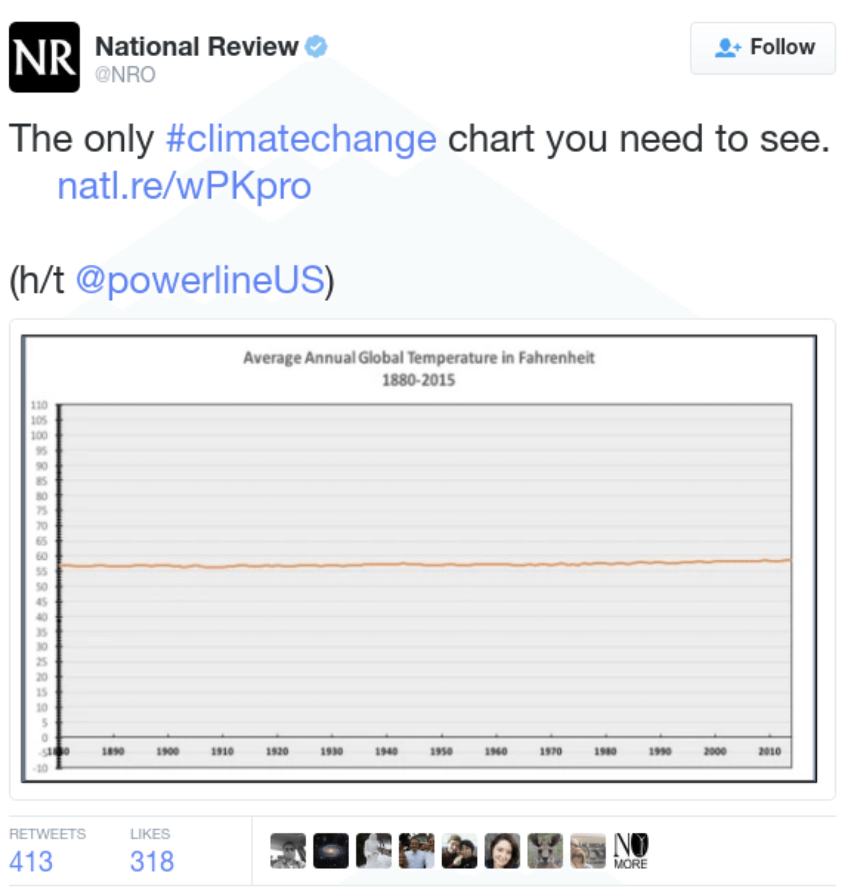{style="float: left;" width="100%"}
:::

::: {.column width="50%"}
   In 2015, the National Review, a conservative magazine, tweeted a chart that displayed the global temperature in Fahrenheit from 1800 to 2015. The title was "the only chart you need to see".
:::
:::::


## A Story About Climate Change


-   The data are from **NASA**'s Goddard Institute for Space Studies (GISS) analysis of global surface temperature change. [@hansen2010]

-   The world's temperature is initially recorded in degrees Celsius.

-   The GISS analysis combines available sea surface temperature records with meteorological station measurements of temperature.

-   Then compared to the years 1951-–1980 as the base period to determine change.

-   Additional adjustments to the average global surface temperature change are made, such as accounting for heterogeneity to minimize local non-climatic effects.


## Interactive Plot


```{python}
import pandas as pd
import plotly.express as px

# Read the data from the CSV file, treating "****" as a missing value
nasa_data = pd.read_csv("../../datasets/NASAdata.csv", na_values="***")

# Select the desired columns (from Year to Dec)
nasa_data = nasa_data.loc[:, "Year":"Dec"]

# Reshape the data from wide to long format using pd.melt()
nasa_data_long = nasa_data.melt(id_vars=['Year'],
                                var_name='Month',
                                value_name='Temperature_Anomaly')

# Create a 'Date' column by combining Year and Month
nasa_data_long['Date'] = pd.to_datetime(
    nasa_data_long['Year'].astype(str) + '-' + nasa_data_long['Month'].astype(str),
    format='%Y-%b'
)

# Calculate the average temperature in Fahrenheit
nasa_data_long['Temperature_Anomaly'] = (nasa_data_long['Temperature_Anomaly']).astype(float)

nasa_data_long['Temperature_Average'] = (nasa_data_long['Temperature_Anomaly'] + 14) * 1.8 + 32

# Create the interactive line plot with Plotly Express
fig = px.line(nasa_data_long, x='Date', y='Temperature_Average')

# Update the layout with a title and an interactive y-axis with a rangeslider
fig.update_layout(
    title="Average Global Surface Temperature (F)",
    yaxis=dict(
        title="Average Temperature",
        #rangeslider_visible=True,
        range=[0, 100]
    )
)

# Display the interactive plot
fig.show()

# To save the plot to an HTML file, use this line
# fig.write_html("nasa_temperature_plot.html")

```

<center>Manipulate the plot by zooming in and out and evaluate temperature at time intervals.</center>

## Interpretation:

- Is a 1 degree change a lot? Domain expertise needed to contextualize findings!


- GISS show "temperature anomalies" by subtracting the mean temperature over some baseline period (1951-1980).  Why might this be more desirable?

- Figures should be designed to tell a story and have a clear purpose.  Simply sharing an interactive visualization might make communication harder.

- Should a static visualization start the y-axis at 0 in this plot? Why or why not?


## Ugly or unethical?


- There is a difference between an ugly visualization and a bad visualization
  + Ugly visualizations are aesthetically unappealing but can still effectively convey information
  + Bad visualizations are misleading or confusing because of they way they are constructed

-   There is also a fine line between poorly constructed visualizations and unethical presentations.

-   Data scientists should remain honest, provide clarity and avoid violations of openness or objectivity.

-   Ensure that your audience has enough information to make an **informed decision** that is not unduly influenced by the presenter's values and biases. [@schroeder2022]

# Features of Poorly Constructed Plots

## The use of 3D Graphs {.scrollable}

::::: columns
::: {.column width="50%"}
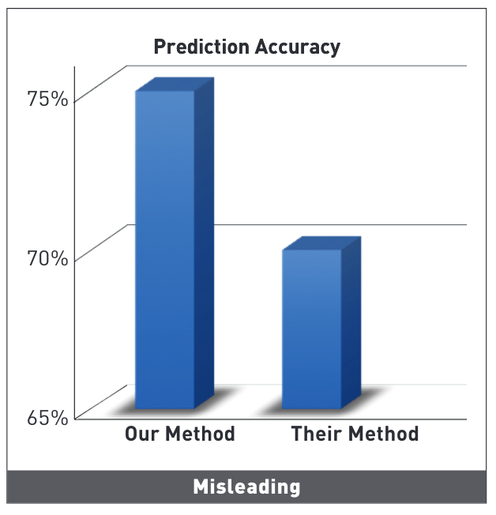
:::

::: {.column width="50%"}
3d figures:

-   are often difficult to read.
-   appear to pop out of the page.
-   axes marks appear to be overlapping, which make some marks more difficult to view than others.
-   lose and distort information when changing between 3d and 2d.
:::
:::::

## Excluding Information

- Excluding information that may impact a readers understanding includes:
  -   x- and y-axis labels,
  -   variable scale of measurement (e.g. kg., log-transformation, etc.),
  -   clear title or figure labels.
    
- Deliberately excluding data or information that might influence the conclusions would be unethical

## Including too Much Information

<center>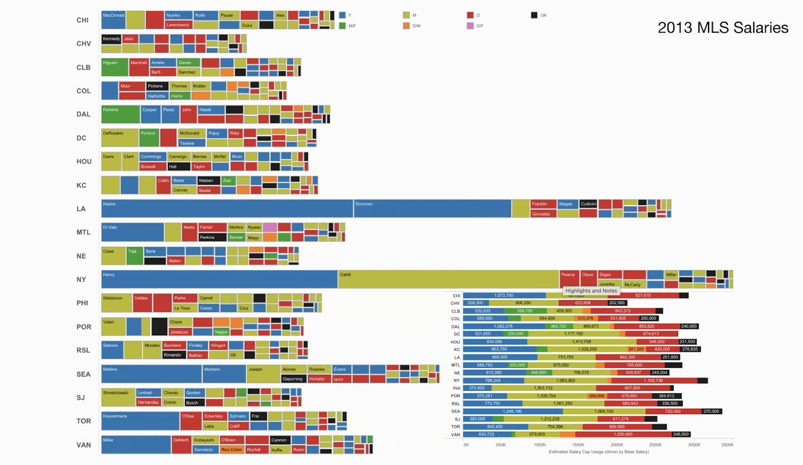</center>

## Including too Much Information

-   Including too much information can have the same effect as leaving out information.
    -   Leaving the audience with more questions and confusion.
    -   General rule:
        -   Provide enough information so that your audience can make an informed decision.
    -   Exclude unnecessary text (subtitles, long title, jargon).
    -   Address disproportionate number of numerical values than actual (i.e.,too many values on the y-axis).


In the primary graph 19 MLS soccer teams and values spent on players salaries. The graph is broken down by several groups: players, players position. The full length of the bars suggest the total amount spent on players salaries. Individual bar can also be used to compare the relative amount invested on each player within a team. In the sub graph, the data is broken down by: players position and dollar amount spent.

## Distorted axis limits

-   Some functions by default fit axis ranges to natural data scales.
-   Non-zero y-axes may suggest that small differences to appear much larger than truth.
-   When dealing with normalized data ensure that the variables are placed on the same scale.

## Distorted axis limits

<center>{width="40%"}</center>

...

This 3d graph starts at 65% rather than 0. By shrinking the y-axis we create the effect that one method has twice as much accuracy than the other.


## Improved axis limits

<center>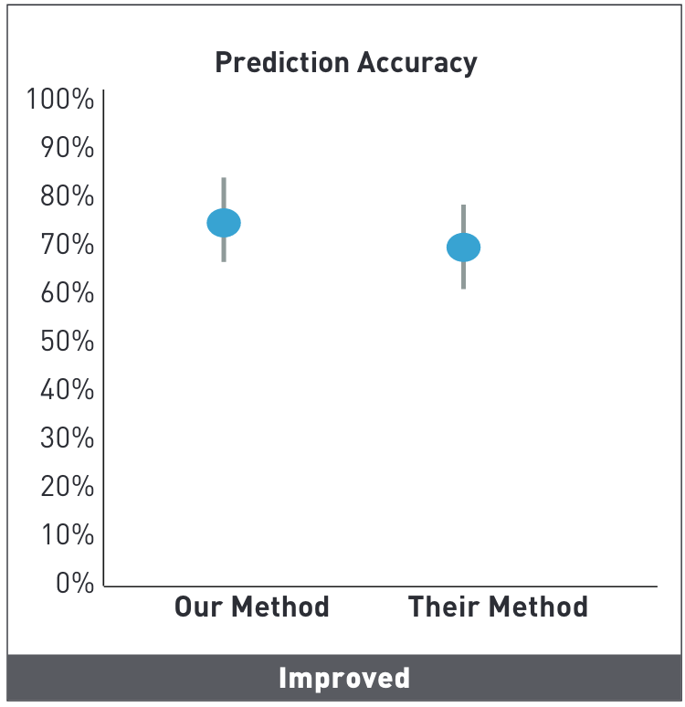{width="40%"}</center>


## Visual Communication

> Excellence in statistical graphics consists of complex ideas communicated with clarity, precision, and efficiency." - [@tufte2001]

Tufte's graphic principles to creating useful figures:

-   The physical representation of numbers on a surface should be proportional to numerical quantities represented.
-   Use clear and comprehensive labels.
-   Write out explanations of the data (e.g., in the text, notes immediately following the graph).
-   Show data variation not design variation.
-   The number of dimensions presented should not exceed the number of dimensions in the data.
-   Graphics should not quote data out of context.


# Accessibility

## Accessibility & Color
  -   Human perceptions of color vary. Upwards of 5-8% of men are colorblind! (less common for women)
  -   Colorblindness and complete blindness present accessibility concerns related to visual presenation of information. [@johnson2024]
  -   [@petroff2024] used a machine learning technique to identify color sequences which considered color blindness types, color lightness, color sequence preferences, and aesthetic preferences.
  -   3 sequences of colors were identified and all began with the color blue.

## Accessibility & Visualizations

<center>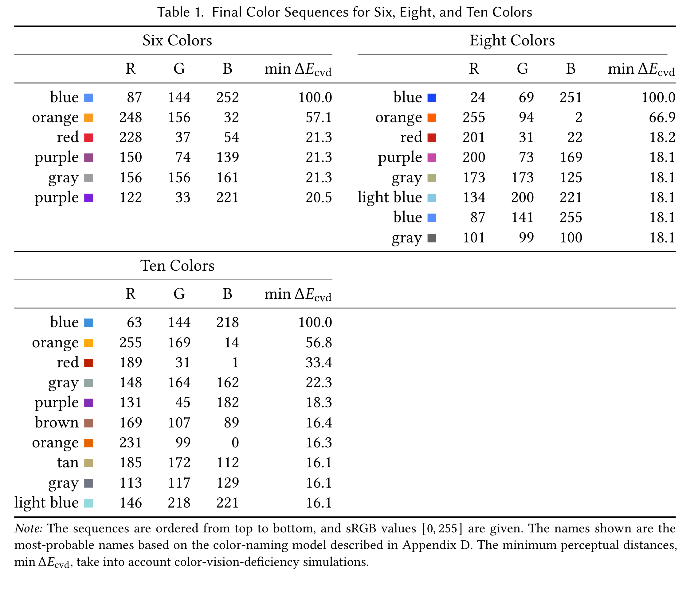{height=5in}</center>

## Accessibility & Color

  -   Surrounding colors influence the perception of others
  
  -   Choose colors that are not difficult to distinguish between each other.
  
  -   Color association
  
  -   Avoid color schemes that engage in stereotypes (i.e., black associated with unsafe and white associated with approachable).
  
       +   Keep color schemes neutral
    
       +   Consider how different mediums (e.g., computer screen, printouts, software) used to display the graphic may influence color.

  - Accessibility is the practice of ensuring that all individuals have equal access to resources, programs, and opportunities, regardless of their abilities or backgrounds.

## Color blindness


- Individual's degree of color blindness may influence the perception of graph or figure. 

- The most common color-blindness types are red-green and blue-purple. Any color that contains the affected primary color is distorted.

- Deuteranomaly and protanomaly are red-green color blindness conditions, with deuteranomaly making green appear redder and protanomaly making red appear dimmer and more green. 


Red-Green Colorblindness

<center>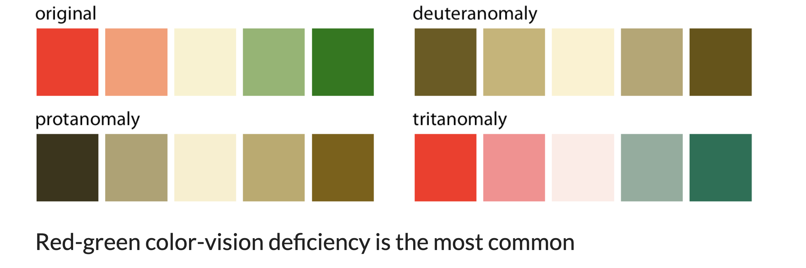{height=2in}</center>


# More CVD

- Tritanomaly is a less common blue-yellow color blindness:

<center>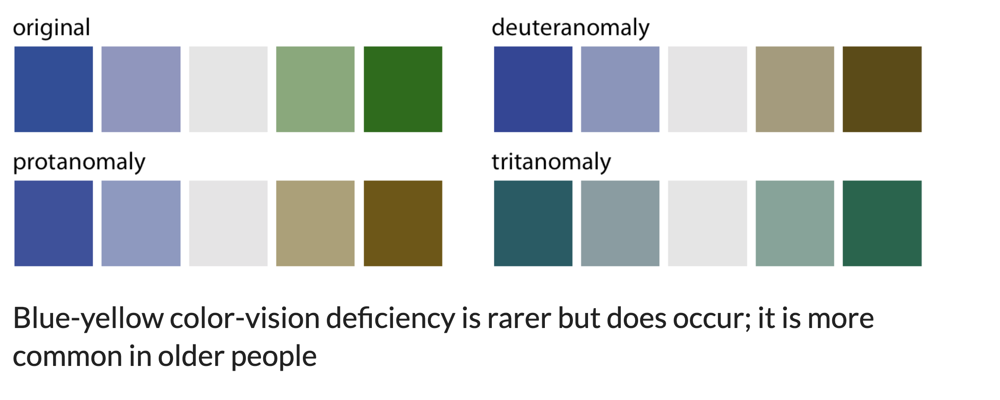{height=2in}</center>

- Accessible Color Palettes

<center>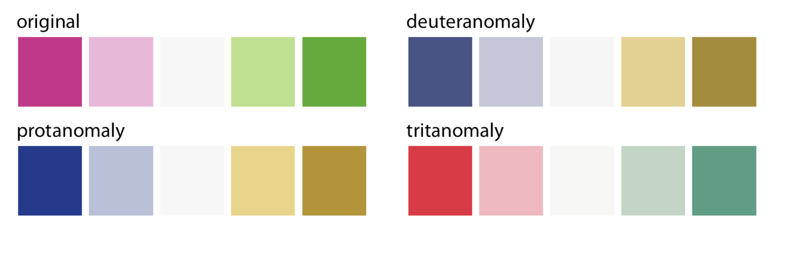{height=2in}</center>


## Common mistakes in use of color

CVD or colorblindness refers to difficulty distinguishing colors

* red-green CVD: protanomaly and deuteranomaly
* blue-yellow CVD: tritanomaly


Some color scales still retain visible contrast for different types of CVD.  *Simulation* for those without CVD.

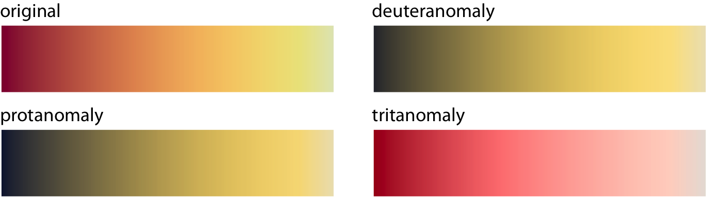{height=3in}


## Outliers

- Outliers often obscure patterns and tend to be benign (data entry or protocol error)

- Best to pre-specify your criteria for excluding outliers prior to analysis

- Show results with and without outliers removed. Clearly state:
  + How many observations were excluded
  + The method used for detection
  + How results differ between analyses
  
- Distinguish from anomalies: 

- What role does the *data collector* have ensuring the quality, representativeness, and completeness of the data?

- What role does the *data analyst* have in identifying any anomalies or data collection errors?

- May consider returning to a discussion on stories/explanations and [Occam's Razor](https://en.wikipedia.org/wiki/Occam%27s_razor).  It's easy to come up with compelling stories about the data, but often it's something as simple as a mistake in data collection.


## How is this figure misleading?

<center>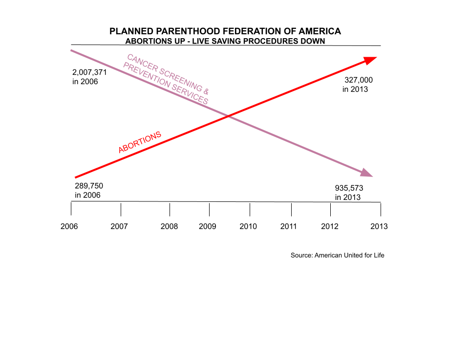</center>

## Context
The infographic was presented in 2015 by Republican Jason Chaffetz, the Chairman of the House Committee on Oversight and Government Reform. This chart was presented to Cecile Richards the head of Planned Parenthood during her testimony at public hearing. The chart suggested that Planned Parenthood performs more abortions than cancer screenings and prevention services. [Source: Committee of Oversight and Accountability Democrats](https://oversightdemocrats.house.gov/news/press-releases/politifact-awards-chaffetz-a-rating-of-pants-on-fire-for-using-misleading-chart)

Key points to note: 

- The total number of cancer screenings and abortions vary dramatically

- Usually best to start the y-axis at 0

- The arrows don't correspond to the real data (graphic is an infographic, not a visualization of real data).

- Can ask students to recreate the visualization, with the data presented as separate lines on the same plot or two side by side plots and discuss how presenting the data in different can be used to tell different stories. Examples follow.


## Side by side plot

```{python}
#suppressPackageStartupMessages(library(tidyverse))
#library(patchwork)

import pandas as pd
import seaborn as sns
import matplotlib.pyplot as plt

# Create the data using a pandas DataFrame
pp_data = pd.DataFrame({
    'year': [2006, 2007, 2008, 2009, 2010, 2011, 2012, 2013],
    'cancerscreen': [2007371, 1900850, 1860413, 1830811, 1596741, 1307570, 1121580, 935573],
    'abortions': [289750, 305310, 324008, 331796, 329445, 333946, 327166, 327653]
})

# Set the plot style to 'whitegrid' (similar to ggplot's theme_bw)
sns.set_style("whitegrid")

# Create a figure with two subplots side-by-side
fig, axs = plt.subplots(1, 2, figsize=(14, 6))

# Plot the cancer screening data on the first subplot
sns.lineplot(data=pp_data, x='year', y='cancerscreen', ax=axs[0])
axs[0].set_title('Cancer Screenings')
axs[0].set_ylabel('Number of Cancer Screenings')
axs[0].set_xlabel('Year')

# Plot the abortion data on the second subplot
sns.lineplot(data=pp_data, x='year', y='abortions', ax=axs[1])
axs[1].set_title('Abortions')
axs[1].set_ylabel('Number of Abortions')
axs[1].set_xlabel('Year')

# Adjust layout to prevent labels from overlapping
plt.tight_layout()

# Show the combined plot
plt.show()

# If you prefer to save the combined plot to a file, use this instead of plt.show()
# plt.savefig("combined_plots.png")

## The following data are collected from Planned Parenthood Federation of American Annual Report from 2006-2013

#year <- c(2006, 2007, 2008, 2009, 2010, 2011, 2012,2013)
#cancerscreen <- c(2007371, 1900850, 1860413, 1830811, 1596741, 1307570, 1121580, 935573)
#abortions <- c(289750, 305310, 324008, 331796, 329445, 333946, 327166, 327653)
#pp_data = tibble(year=year, cancerscreen=cancerscreen, abortions=abortions)
#```

#```{r,}
#cancer_plot <- pp_data |> ggplot() + geom_line(aes(x=year, y=cancerscreen)) + #theme_bw(base_size=16) 
#abortion_plot <- pp_data |> ggplot() + geom_line(aes(x=year, y=abortions)) + theme_bw(base_size=16)

## Plot them side by side
#cancer_plot + abortion_plot 
```


## On the same plot

```{python}
#pp_data |> pivot_longer(-year, names_to = "Type", values_to="Count") |>
#  ggplot() +
#  geom_line(aes(x=year, y=Count, col=Type)) + 
# ylab("") +
# theme_bw(base_size=16)
# Reshape the data from wide to long format using pd.melt()
# This is the equivalent of pivot_longer()
pp_data_long = pp_data.melt(id_vars=['year'],
                            value_vars=['cancerscreen', 'abortions'],
                            var_name='Type',
                            value_name='Count')

# Set the plot style to 'whitegrid' (similar to ggplot's theme_bw)
sns.set_style("whitegrid")

# Create the line plot
sns.lineplot(data=pp_data_long, x='year', y='Count', hue='Type')

# Set the y-axis label to an empty string
plt.ylabel("")
plt.show()
```

## {.instructor-discussion} 

What's the best way to compare data across multiple groups?

- Same plot? Different plot?

- Absolute vs relative? Depends on the goal.
  - Cancer screenings did indeed drop by almost a factor of 2 over the 7 year span, likely due to changes in access to healthcare.
  - Cancer screenings still represent far more of the services provided 
  
- What is the best way to accurately and ethically convey the meaning of this data?

## Case study: cancer deaths

- Since 1980, have cancer deaths in different countries been increasing, decreasing or remaining roughly constant? 


```{python}
#cancer_data <- read_csv("data/IHME_cancer.csv")

#cancer_data |> filter(cause_name == "Total cancers",
#                      age_name == "All ages",
#                      metric_name == "Rate",
#                      location_name == "United States of America") |> 
#  ggplot() + geom_line(aes(x=year, y=val)) + theme_bw() + 
#  ylab("Cancer Deaths (per 100000 people)") + 
#  ggtitle("United States")
import pandas as pd
import seaborn as sns
import matplotlib.pyplot as plt

# Read the data from the CSV file
cancer_data = pd.read_csv("../../datasets/IHME_cancer.csv")

# Filter the data based on the specified conditions
filtered_cancer_data = cancer_data[
    (cancer_data['cause_name'] == "Total cancers") &
    (cancer_data['age_name'] == "All ages") &
    (cancer_data['metric_name'] == "Rate") &
    (cancer_data['location_name'] == "United States of America")
]

# Set the plot style to 'whitegrid' (similar to ggplot's theme_bw)
sns.set_style("whitegrid")

# Create the line plot
sns.lineplot(
    data=filtered_cancer_data,
    x="year",
    y="val"
)

# Set the y-axis label
plt.ylabel("Cancer Deaths (per 100000 people)")

# Set the title
plt.title("United States")

# Show the plot
plt.show()

# If you prefer to save the plot to a file, use this instead of plt.show()
# plt.savefig("cancer_deaths_usa.png")
```


## What story does the data tell?

```{python}
#cancer_data <- read_csv("data/IHME_cancer.csv")

#cancer_data |> filter(cause_name == "Total cancers",
#                      age_name == "All ages",
#                      metric_name == "Rate",
#                      location_name %in% c("Japan", "Uganda")) |> 
#  ggplot() + geom_line(aes(x=year, y=val, col=location_name)) + theme_bw(base_size=16) + 
#  ylab("Cancer Deaths (per 100000 people)")
import pandas as pd
import seaborn as sns
import matplotlib.pyplot as plt

# Read the data from the CSV file
cancer_data = pd.read_csv("../../datasets/IHME_cancer.csv")

# Filter the data based on the specified conditions
filtered_cancer_data = cancer_data[
    (cancer_data['cause_name'] == "Total cancers") &
    (cancer_data['age_name'] == "All ages") &
    (cancer_data['metric_name'] == "Rate") &
    (cancer_data['location_name'].isin(["Japan", "Uganda"]))
]

# Set the plot style to 'whitegrid' (similar to ggplot's theme_bw)
sns.set_style("whitegrid")

# Create the line plot
sns.lineplot(
    data=filtered_cancer_data,
    x="year",
    y="val",
    hue="location_name"
)

# Set the y-axis label
plt.ylabel("Cancer Deaths (per 100000 people)")

# Add a title for clarity (optional)
plt.title("Total Cancer Death Rates for Japan and Uganda")

# Show the plot
plt.show()

# If you prefer to save the plot to a file, use this instead of plt.show()
# plt.savefig("cancer_deaths_japan_uganda.png")
```

This visualization is valid, but perhaps misleading. Why?


## Median age over time

```{python, fig.height=2}
#age_data <- read_csv('data/median-age.csv')

#age_data |> 
#  mutate(Country = Entity, `Median age` = `Median age - Sex: all - Age: all - Variant: estimates`) #|> 
#  filter(Year < 2025 & Year > 1980) |> 
#  filter(Entity %in% c("Japan", "Uganda")) |> 
#  ggplot() + geom_line(aes(x=Year, y=`Median age`, col=Country)) + theme_bw(base_size=16) + 
#  ylab("Median Age")
import pandas as pd
import seaborn as sns
import matplotlib.pyplot as plt

# Read the data from the CSV file
age_data = pd.read_csv("../../datasets/median-age.csv")

# Rename the columns for easier use
age_data = age_data.rename(columns={
    'Entity': 'Country',
    'Median age - Sex: all - Age: all - Variant: estimates': 'Median age'
})

# Filter the data to include only the years between 1980 and 2025
# and the specified countries (Japan and Uganda)
filtered_age_data = age_data[
    (age_data['Year'] > 1980) &
    (age_data['Year'] < 2025) &
    (age_data['Country'].isin(["Japan", "Uganda"]))
]

# Set the plot style to 'whitegrid' (similar to ggplot's theme_bw)
sns.set_style("whitegrid")

# Create the line plot
sns.lineplot(
    data=filtered_age_data,
    x="Year",
    y="Median age",
    hue="Country"
)

# Set the y-axis label
plt.ylabel("Median Age")

# Add a title for clarity (optional)
plt.title("Median Age Over Time for Japan and Uganda")

# Show the plot
plt.show()

# If you prefer to save the plot to a file, use this instead of plt.show()
# plt.savefig("median_age_plot.png")

```

:::attribute
Source: [ourworldindata.org](https://ourworldindata.org/grapher/median-age)
:::


- Japan is a country that is getting older

- Uganda is a relatively young country with a lower life expectancy

- Age is one of the most important predictors of cancer.  Fewer people live to old age to get cancer in Uganda.

## Age-Standardized Cancer Deaths

```{python}
#cancer_data <- read_csv("data/IHME_cancer.csv")

#cancer_data |> filter(cause_name == "Total cancers",
#                      age_name == "Age-standardized",
#                      metric_name == "Rate") |> 
#  ggplot() + geom_line(aes(x=year, y=val, col=location_name)) + theme_bw(base_size=16) + 
#  ylab("Cancer Deaths (age-standardized)")

import pandas as pd
import seaborn as sns
import matplotlib.pyplot as plt

# Read the data from the CSV file
cancer_data = pd.read_csv("../../datasets/IHME_cancer.csv")

# Filter the data based on the specified conditions
filtered_cancer_data = cancer_data[
    (cancer_data['cause_name'] == "Total cancers") &
    (cancer_data['age_name'] == "Age-standardized") &
    (cancer_data['metric_name'] == "Rate")
]

# Set the plot style (similar to theme_bw)
sns.set_style("whitegrid")

# Create the line plot
plt.figure(figsize=(10, 6)) # Optional: set a figure size for better readability
sns.lineplot(
    data=filtered_cancer_data,
    x="year",
    y="val",
    hue="location_name"
)

# Set the y-axis label
plt.ylabel("Cancer Deaths (age-standardized)")

# Optional: Set the title for the plot
plt.title("Age-Standardized Cancer Death Rates Over Time by Location")

# Display the plot
plt.show()

# If you want to save the plot instead of showing it
# plt.savefig("cancer_deaths_plot.png")
```
See [https://ourworldindata.org/age-standardization](https://ourworldindata.org/age-standardization) for more discussion.

## Comparability

- Always consider relevant reference or comparison groups

- Ask: is standardization needed for fair comparison? Are there lurking variables?

- Highlights that expertise is often needed to generate the most appropriate visualization 

- Visualizations can be misleading without the relevant context


Some useful discussion questions about responsibility and power dynamics:

- How do power dynamics change what stories get told with data and how that data is presented?

- Is the creator of a visualization responsible for how that visualization is interprted and used?

- What makes somebody qualified to visualize data? 

## Principles of effective visualizations 

* **Novel.** Novel visuals don't need to elicit superlative reactions, but they should (if only subtly) surprise and spark interest to some extent.
    
* **Informative**. Informative visuals make information apparent. In a way they are *unambiguous*.
    
* **Efficient**. Efficient visuals have an accessible message. They use space economically but without becoming overly complicated.
    
* **Pleasant**. Visuals should be nice to look at!

A good figure should:

* convey a clear message or story
* avoid excessive complexity
* look nice
* be well-labeled and appropriately sized
* stand alone with a short caption

## Color

Color is one of the most frequently used aesthetics and is easy to misuse.

* choice of color scale should match the data
* use of color should take account of colorblindness
* color can only encode a limited amount of information

There are three types of **color scales**:

1. *Qualitative* scales are non-monotonic sets of colors.
2. *Sequential* scales are monotonic sets of colors spanning a color gradient.
3. *Diverging* scales are sequential scales centered at a neutral color.

## Color scales

:::{.columns}

:::{.column width=33%}

*Qualitative* scales are non-monotonic sets of colors.


Useful for displaying categorical variables with few levels.


:::

:::{.column width=33%}
*Sequential* scales are monotonic sets of colors spanning a color gradient.


Useful for continuous variables.


:::

:::{.column width=33%}

*Diverging* scales are sequential scales centered at a neutral color.


Useful for continuous variables with a 'natural' center.

:::

:::


## Illustrating scales

:::{.columns}

:::{.column width=45%}


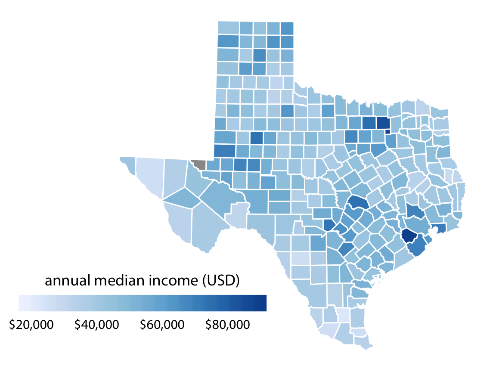


:::

:::{.column width=45%}


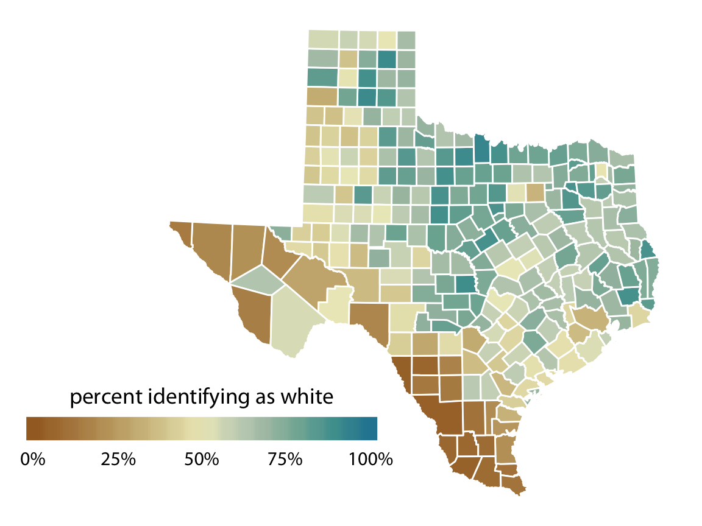


:::

:::


## TMI

:::{.columns}

:::{.column width=45%}
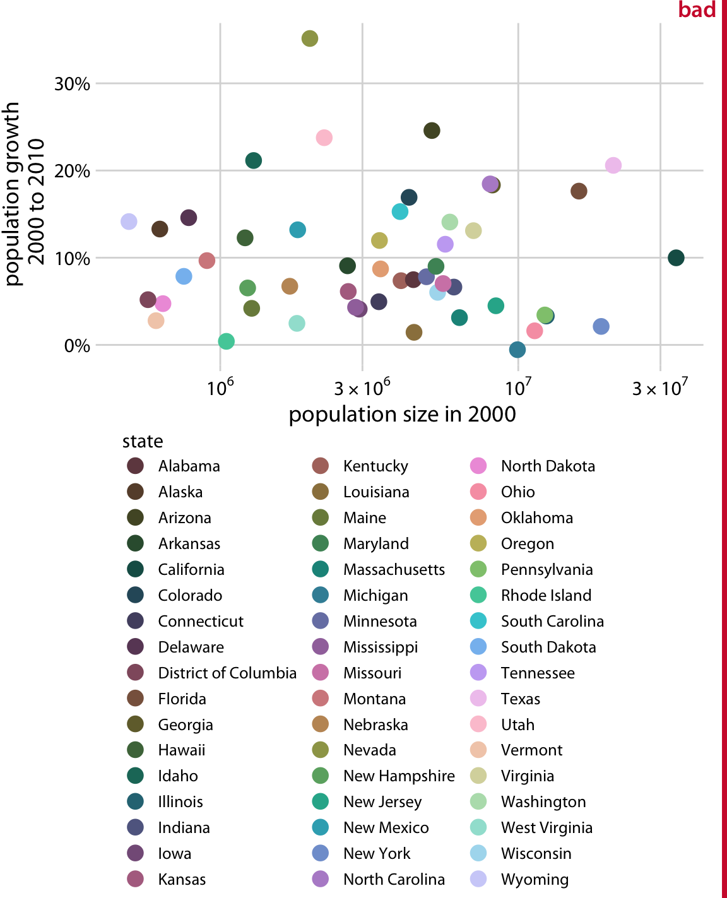{height=4in}
:::

:::{.column width=45%}
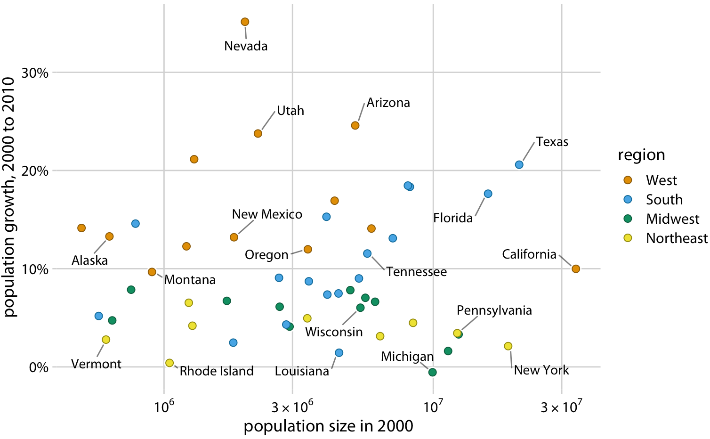

Better

:::

:::


Avoid encoding more than *5 categories using color*

## Inappropriate scales

The color scale doesn't match the data well, since the rainbow scale emphasizes arbitrary data values. In addition, colors here are too intense.

::: {.columns}

::: {.column width=45%}

:::

::: {.column width=45%}


:::

:::

. . .

A diverging scale is appropriate here because 50% is a natural midpoint in context.


## Another approach: redundancy

When possible, use 'redundant coding' -- map the same variable to color *and* one other aesthetic.

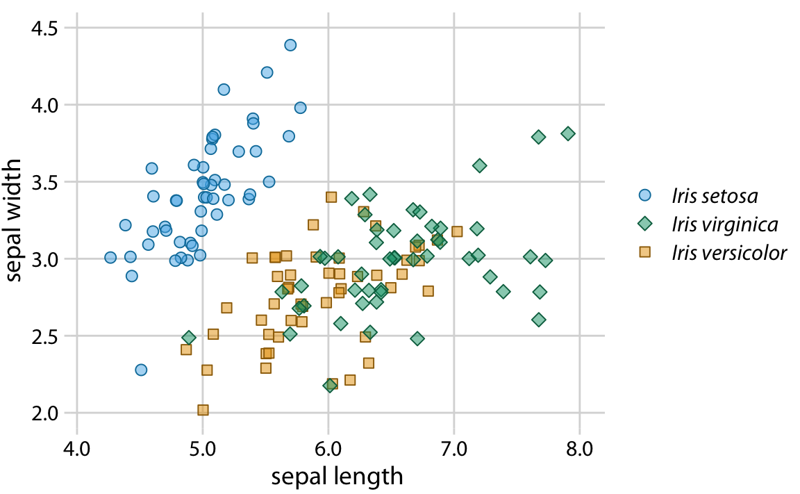

## Redundancy

When possible, use 'redundant coding' -- map the same variable to color *and* one other aesthetic.

```{python}
#| tags: []

pop = pd.read_csv('../../datasets/population.csv', encoding = 'latin1').melt(
    id_vars = ['Country Name', 'Country Code'],
    var_name = 'Year',
    value_name = 'Population'
)

countryinfo = pd.read_csv('../../datasets/country-info.csv').rename(
    columns = {'alpha-3': 'Country Code', 'region': 'Region'}
).loc[:, ['Country Code', 'Region']]

popregion = pd.merge(
    countryinfo, 
    pop, 
    how = 'right', 
    on = ['Country Code']
).dropna().astype(
    {'Region': 'category'}
).groupby(
    ['Region', 'Year']
).sum().reset_index()

alt.Chart(
    popregion
).mark_line(
).encode(
    x = 'Year:T',
    y = alt.Y('Population', scale = alt.Scale(type = 'log', zero = False)),
    color = 'Region',
    strokeDash = 'Region'
).properties(
    width = 400, height = 200
).configure_axis(
    labelFontSize = 16,
    titleFontSize = 16
).configure_legend(
    labelFontSize = 16,
    titleFontSize = 16
)
```


Redundancy provides a failsafe against *any* circumstance that might compromise the effectiveness of color:

- printers or black-and-white printing
- projectors, displays, and lighting conditions
- CVD


## Faceting

**Facets** are another way to encode categorical variables *when side-by-side comparisons are of interest*.

The most common blunders with faceting are:

1. Free axis scales are misleading
2. Facet layout isn't conducive to comparison of interest

## Many facets {.smaller}

A **big panel** of simple scatterplots can be a useful exploratory graphic.

::: {.columns}

::: {.column width=60%}
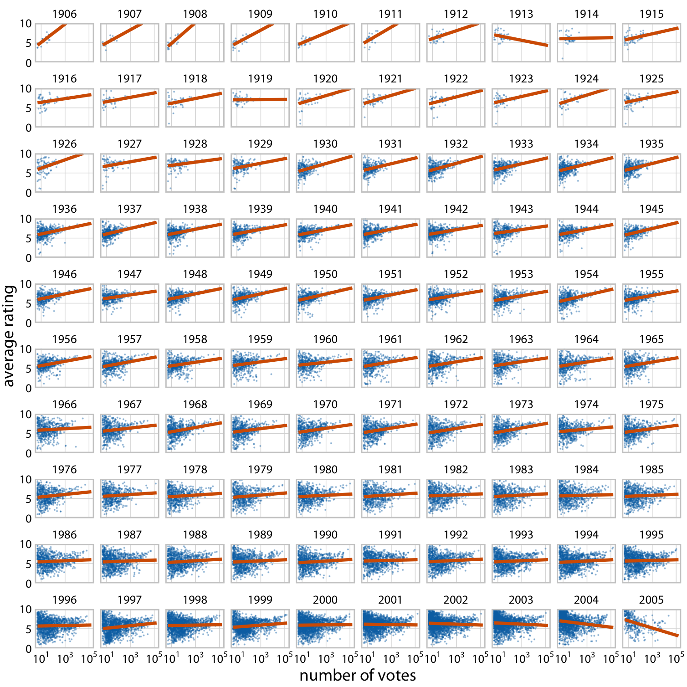{width=500}
:::

::: {.column width=40%}
The figure shows a lot:

1. Timespan of data 1906-2005
2. More observations (movies) in later years
3. Higher vote counts in later years
4. Higher rating variance among movies with fewer votes
5. Long term reversal of voting/rating trend
:::

:::

## Use fixed axis scales

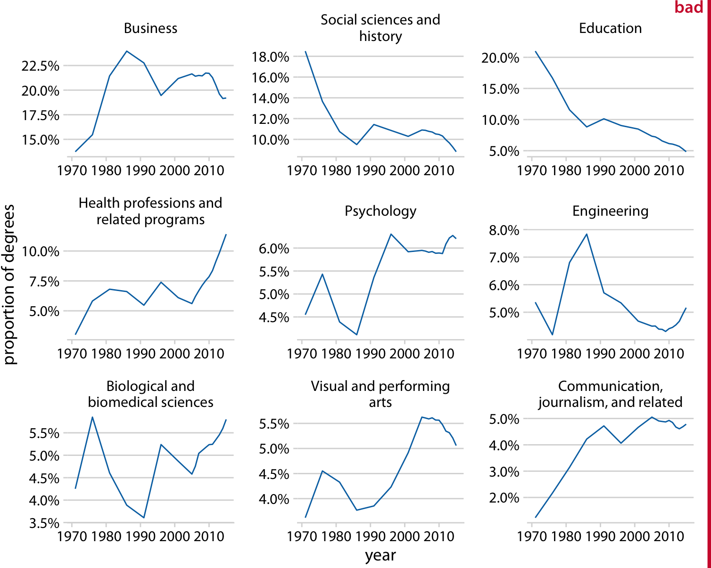


Suggests, misleadingly, that Education declined by the same amount as social science and history.

## Use fixed axis scales

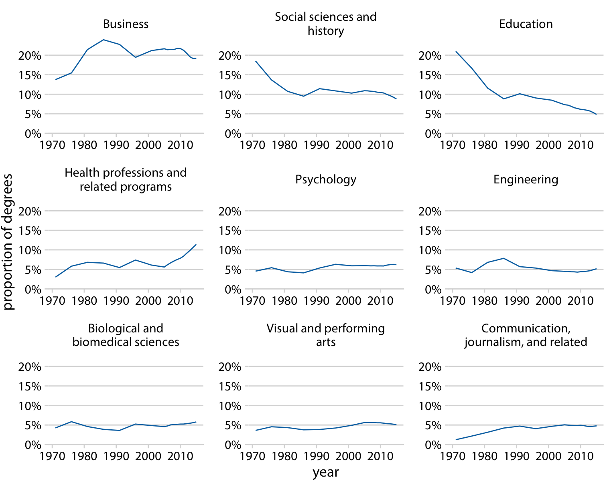{height=4in}

## What about this?

One axis is fixed, one is free.

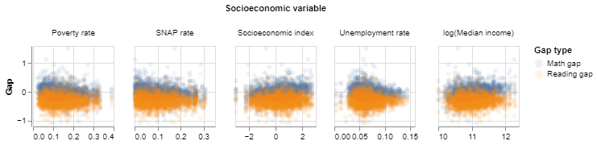{height=2.5in}

. . .

The variable of interest, Gap, is still comparable across facets. So only one axis needs to be fixed.

What would it look like if all axis scales were fixed? Would comparisons be easier or harder?

## Labels and legends

For sizing, it's important to pay attention to the *balance* of labels, whitespace, and graphical elements. Avoid


1. Use of dataframe column names as labels
2. Obscure or uninterpretable labels
3. Too small or too big


Usually figure defaults look fine on your IDE but render **too small** when graphics are exported.

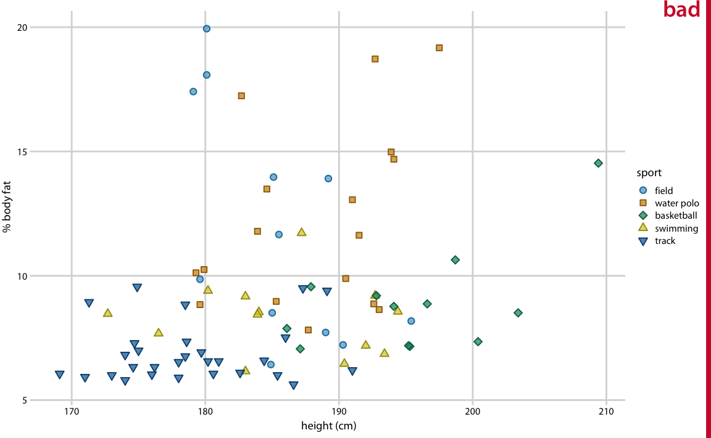

## Sizing

::: {.columns}

::: {.column width=45%}

These labels are legible, but still too small -- they take up a minimum of space in the figure.

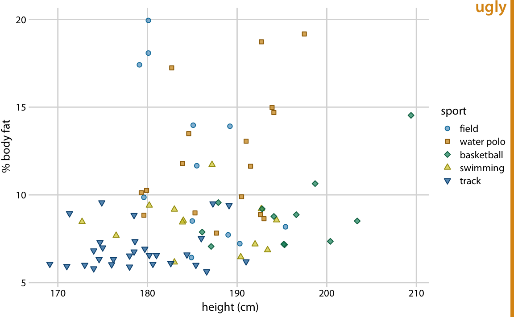

:::

::: {.column width=45%}
But don't overdo it.

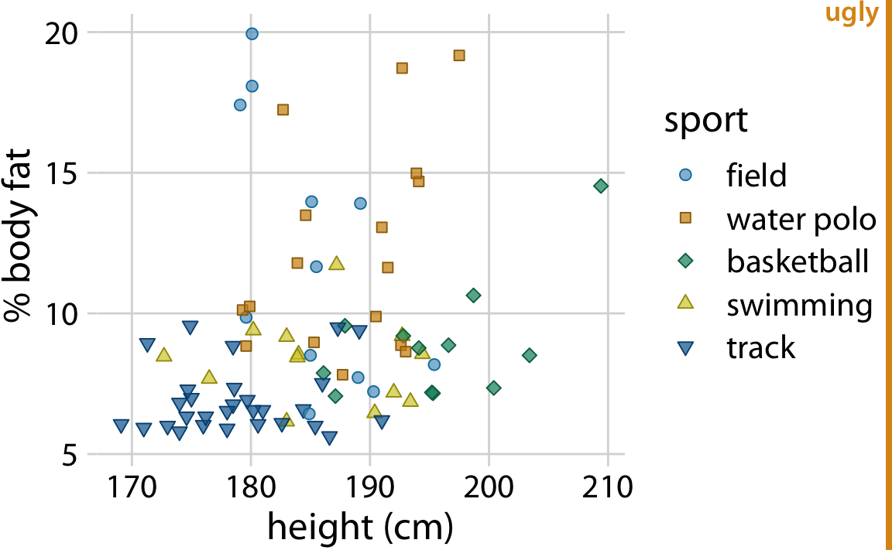

:::

:::


## Sizing

Use larger labels than you think you'll need.

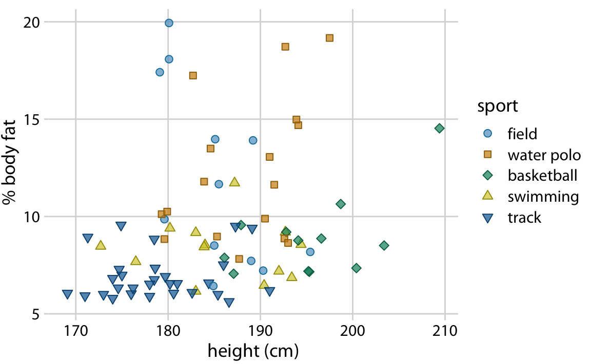

Note also the mark size is increased a bit.

## Sizing

If the figure will be reproduced in a scaled-down size, increase all sizes in proportion.

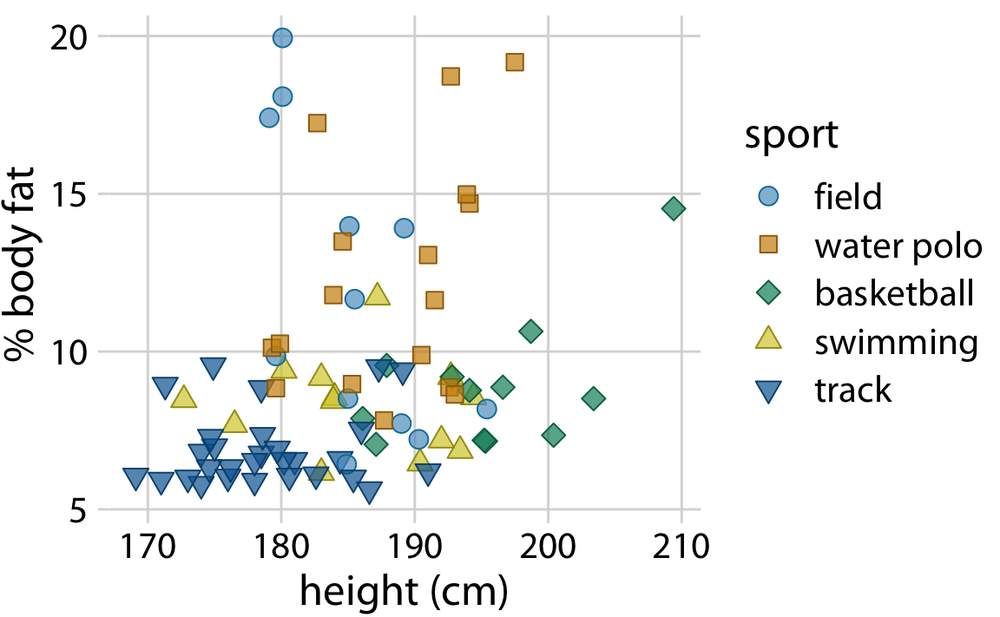

## Critiques {.smaller}

Series from [NYC Life Expectancy Dropped 4.6 Years in 2020](https://www.nytimes.com/2023/04/07/nyregion/nyc-covid-deaths.html)

::: {.columns}

::: {.column width=60%}
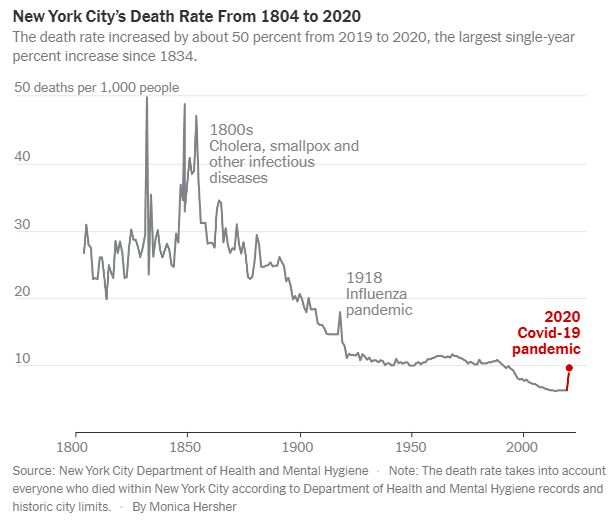
:::

::: {.column width=40%}
Positive:

* effective use of labels
* effective use of highlighting
* well-proportioned
* clean axes

Negative:

* COVID spike looks minimal, contrary to story?
* the most striking feature of the plot is the time trend and variance stabilization 
:::

:::


## References