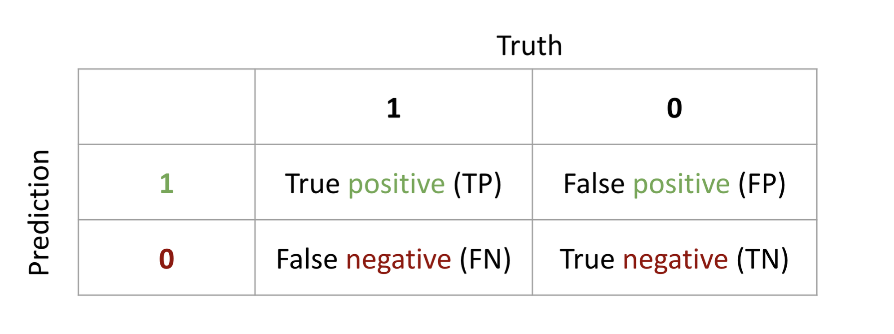
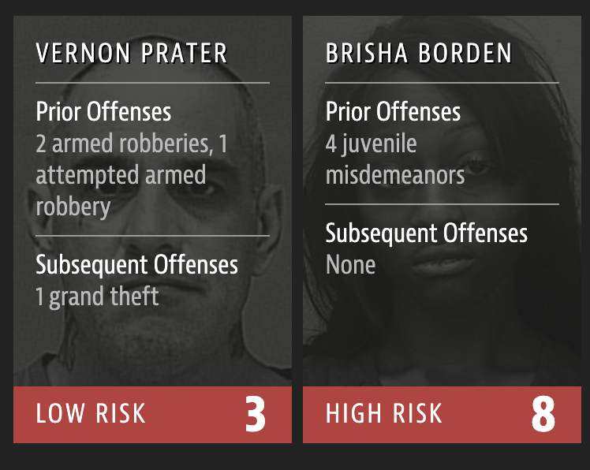

```{python}
#| echo: false
#| slideshow: {slide_type: skip}
import pandas as pd
import numpy as np
import seaborn as sns
import matplotlib.pyplot as plt
import IPython.display as display
```

## Overview of this week

1.  Defining ethics
2.  Ethical issues related to computers and data
3.  Case study: COMPAS recidivism
4.  Case study: Swain's Jury
5.  Case study: Simpson's paradox 


## Defining Ethics

"The subject matter of ethics is supplied by two intimately related terms, right and good" [@sharp1928a].

-   Definition:
    -   The judgment upon actions which are categorized as right or wrong
    -   The societal use of terms good and bad
-   Ethics derived from the Greek word ethos - spirit of the community.
-   Ethicists try to answer "What actions are regarded as right or wrong by the members of it's society?"

## Establishment of Ethics in Science

-   The study of ethics dates back to work of Socrates, Plato, and Aristotle
    -   Hippocratic Oath
        -   Established several medical principles that are still significant today, including consent.
-   Ethics in experimental science was a global concern after WWII
    -   Nuremberg Code (1947)
        -   A set of ethical research principles for human experimentation as a result of the Nazi Nuremberg trials.

Advancements in computer and data communications technology have resulted in the need to reevaluate the application of ethical principles. 

- quote from [@weiss1990] "The XXII self-assessment: The ethics of computing"


## Ethical Issues Related to Computers and Data {.smaller}

Many of the daily work-related responsibilities of data scientists rely on making an ethical choice


::: panel-tabset
### Data privacy

-   Data privacy legislation differs across jurisdictions.

-   *Data privacy* in the [California Consumer Protection Act](https://leginfo.legislature.ca.gov/faces/codes_displayText.xhtml?division=3.&part=4.&lawCode=CIV&title=1.81.5) is the protection of personal information (e.g., Name, email address, purchase and browsing history, location and employment data, IP address, sensitive personal information)

### Social justice

-   *Social justice* in data science includes practices that promote equity and fairness, focusing on ensuring that data and reports accurately and adequately represent populations. Practicing reflexivity is especially important to identify personal bias while performing data science tasks.

### Transparency

-   *Transparency* relates to communicating with customers about data collection (design, amount, and duration of storage) and the ease with which other data scientists can access collected information. Transparency related to data is especially important for building trust with customers and other data practitioners.

### Consent

-   *Consent* is an agreement before data collection that lists a participant's rights to information about a research study or organization's information collection. Participants can terminate their participation and opt out of data use at any time. Changes to informed consent have made it easier for companies to obtain broad consent, which does not require re-consent for the re-use of data [@froomkin2019] .

### Accuracy

-   *Accuracy* relates to the characteristics of high-quality data, which are highly complete, valid, and consistent.

### Accountability

-   *Accountability* relates to a data scientist's quality of work, which delineates decisions and processes to create reproducible work that follows company guidelines and adheres to laws.
:::

## Ethical Issues Related to Computers and Data: Example

-   **Uber** was fined millions by the Netherlands government after a watchdog found that the U.S. company was transferring data about drivers from the Netherlands to the U.S.
-   **Target** was sued after a father was able to determine that his daughter was pregnant. A predictive algorithm determined that she was likely pregnant given the items she purchased and sent coupons for expecting mothers.


-   Greater public access to computers raised ethical concerns [@weiss1990]:
    -   Ownership of assets/material (e.g., programs, code, visual material)
    -   The degree that programs, software, and computer users are held responsible for outcomes

## Legal Frameworks which Regulate Data Science

-   There is variation across jurisdictions in the laws relating to privacy protection and permissible data usage.
-   Two common themes in the **EU** and **US** legislation which are fundamental to data protection :
    -   Anti-discrimination rights
    -   Personal data protection rights

## Legal Frameworks which Regulate Data Science

-   Anti-discrimination Rights in the U.S. 
       - The Civil Rights Act of 1964 prohibits discrimination based on color, race, sex, religion, or nationality, 
       - The Disabilities Act of 1990 prohibits discrimination based on disability

-   Personal data protection in the U.S.
    -   In the United States, the [Fair Information Practice Principles](https://www.fpc.gov/resources/fipps/) (1973) delineate principles that agencies use when evaluating information systems, processes, programs, and activities that affect individual privacy
     -   Since 2017, an increase in proposed laws and regulations related to AI have been proposed 
    - [The US's Blueprint for an AI Bill of Rights](https://www.whitehouse.gov/ostp/ai-bill-of-rights/)\

## Data Ethics Principles

-   To provide broad guidance,various organizations (e.g., [ASA](https://www.amstat.org/your-career/ethical-guidelines-for-statistical-practice), [@americanstatisticalassociation2022a]) and government agencies have proposed numerous data ethics principles.
-   These principles vary in number, scope, and practicality
-   Different corporations may chose to uphold the principles that meet and fit the company's culture due to the lack of federal legislation

## Data Ethics Principles (OECD)

-   The Organization for Economics Co-operation and Development's (OECD) [@oecd2002] guidelines in the Protection of Privacy and Trans border Flows of Personal Data are one of the most supported set of principles by U.S. government agencies.

::: columns
::: {.column width="25%"}
1.  Collection Limitation Principle
2.  Data Quality Principle
:::

::: {.column width="25%"}
3.  Purpose Specification Principle
4.  Use Limitation Principle
:::

::: {.column width="25%"}
5.  Security Safeguards Principle
6.  Openness Principle
:::

::: {.column width="25%"}
7.  Individual Participation Principle
8.  Accountability principles
:::
:::

## Data Ethics Principles (OECD)

1.  __Collection Limitation Principle__: There should be limits to the collection of personal data and any such data should be obtained by lawful and fair means and, where appropriate, with the knowledge or consent of the data subject.

2.  __Data Quality Principle__: Personal data should be relevant to the purposes for which they are to be used, and, to the extent necessary for those purposes, should be accurate, complete and kept up-to-date.

3.  __Purpose Specification Principle__: The purposes for which personal data are collected should be specified no later than at the time of data collection and the subsequent use limited to the fulfillment of those purposes or such others as are not incompatible with those purposes and as are specified on each occasion of change of purpose.

## Data Ethics Principles (OECD)


4.  __Personal data__ should not be disclosed, made available or otherwise used for purposes other than those specified in accordance with Principle 3, except:

a)  with the consent of the data subject; or 

b) by the authority of law.

5.  __Security Safeguards Principle__: Personal data should be protected by reasonable security safeguards against such risks as loss or unauthorized access, destruction, use, modification or disclosure of data.


## Data Ethics Principles (OECD)

6.  __Openness Principle__: There should be a general policy of openness about developments, practices and policies with respect to personal data. Means should be readily available of establishing the existence and nature of personal data, and the main purposes of their use, as well as the identity and usual residence of the data controller.

7.  __Individual Participation Principle__: An individual should have the right to obtain from a data controller, or otherwise, confirmation of whether or not the data controller has data relating to them; and to have communicated them that data relating to them.

8.  __Accountability Principle:__ A data controller should be accountable for complying with measures which give effect to the principles stated above.

## Group Discussion

How does data science play a role in this example? What **dilemmas** must data scientists consider?

::: callout-note
## Discussion (4 minutes)

In 2017, Meta announced that they analyze and flag user-generated content related to suicidal intent or risk (e.g., post and comments). Later, Meta announced that the company used the suicide predictions to notify local authorities and that over 100 wellness checks were conducted by law-enforcement. Meta also announced that the suicide detection program would expand across all other countries. In 2018, Meta revealed that they also scan the content of users' private messages for suicide risk.
:::

<center>

<iframe width="320" height="100" src="https://vclock.com/embed/timer/#countdown=00:04:00&amp;enabled=0&amp;seconds=240&amp;theme=0&amp;ampm=1&amp;sound=xylophone" frameborder="0" allowfullscreen>

</center>

</iframe>


## Ethical Practices and Considerations {.smaller}

To meet data ethic principles and engage in socially-just data science, practitioners (e.g. data scientists, researchers) can practice the following:

::: panel-tabset
### Honesty

-   Remain honest about level of competence related skill, content/subject, potential bias, and timeliness.

### Understanding

-   Understand responsibilities to ensure their skills can address the stakeholders (i.e., clients and participants) needs.

### Communication

-   Communicate the limitations of the research design and analytic approach.

### Reporting

-   When reporting your findings, clearly convey steps, logic, and findings so that other data practitioners and the public understand.

### Protection

-   Engage in data science practices processes that protect humans and animals and minimize harmful impact

### Cite

-   Acknowledge the work of other data practitioners and researchers that were used.

### Report

-   Address ethical misconduct by reporting to appropriate authority, which will investigate ethical issues and or violations.
:::

## Ethical Practices and Considerations

Algorithms affect the lives of individuals, sometimes in profound ways <br>

::: callout-note
## Question

What are example of algorithms that you've encountered in your life which have influenced your life or your behavior?
:::

::: callout-note
## Question

What are the ethical practices and considerations that you think the creator of algorithm(s) did or did not take into account?
:::


## Case Study: Criminal Risk Assessment

-   Machine learning is increasingly used to to inform decisions about individuals in the criminal justice system

    -   Setting bond amounts
    -   Length of sentence

-   One major component of these decisions is trying to evaluate a defendant's risk of future crime

-   *Recidivism*: the tendency of a convicted criminal to re-offend.

-   In 2016, [ProPublica published an a story](https://www.propublica.org/article/machine-bias-risk-assessments-in-criminal-sentencing) about one of the most used algorithms called 'COMPAS'

-   **COMPAS** stands for Correctional Offender Management Profiling for Alternative Sanctions, and was mostly used to assess the risk of a pretrial release

-   In their article, they conducted a rigorous analysis of possible bias by analyzing data and COMPAS predictions from more than 10,000 criminal defendants in Broward County, Florida

## Fairness & Transparency

-   **Fairness**: ideally, COMPAS would have the same impact on all demographic subgroups. Probably not possible!

-   **Transparency**: COMPAS is a *closed-source* algorithm. The public is not allowed to see how the algorithm works.

::: callout-note
## Question

What information about an individual do you think is "fair" to include in an algorithm which predicts recidivism? What information would be "unfair"?
:::

## COMPAS data

The risk-scores are derived come from answers to a 137 question survey and the defendants criminal record.

**Predictors** used by COMPAS include:

-   Prior arrests and convictions (and if any friends had priors)

-   Address, GPA, wealth

-   If the defendant's parents separated

. . .

::: callout-important
Purportedly, race is not used as a predictor.
:::

## Recidivism Data

```{python}
import pandas as pd
import numpy as np
compas_scores = pd.read_csv('../../datasets/compas-scores-two-years.csv')

compas_scores = compas_scores[['age', 'c_charge_degree', 'race', 'age_cat', 'score_text', 'sex', 'priors_count',
                               'days_b_screening_arrest', 'decile_score', 'is_recid', 'two_year_recid',
                               'c_jail_in', 'c_jail_out']]

compas_scores = compas_scores[(compas_scores['days_b_screening_arrest'] <= 30) &
                              (compas_scores['days_b_screening_arrest'] >= -30) &
                              (compas_scores['is_recid'] != -1) &
                              (compas_scores['c_charge_degree'] != 'O') &
                              (compas_scores['score_text'] != 'N/A')]
```

There are `{python} compas_scores.shape[0]` observations in the data we'll analyze. `{python} 100*np.round((1-np.mean(compas_scores["score_text"] == "Low")), 3)`% of individuals received a high risk score.

```{python}
#| layout-ncol: 2
from tabulate import tabulate
import plotly.graph_objects as go

# Group by 'age_cat' and calculate proportions
compas_scores_grouped_age = (
    compas_scores[['age_cat', 'race']]
    .groupby('age_cat')
    .size()
    .reset_index(name='count')
)

# Calculate proportions
compas_scores_grouped_age['proportion'] = compas_scores_grouped_age['count'] / len(compas_scores)

# Format the proportions to 2 decimal places
compas_scores_grouped_age['proportion'] = compas_scores_grouped_age['proportion'].round(2)

# Display table using tabulate for formatting
#print(tabulate(compas_scores_grouped_age[['age_cat', 'proportion']],
#               headers=["Age Group", "Proportion"],
#               tablefmt="fancy_grid"))

header = dict(values=["Age Group", "Proportion"],
              fill_color='#F9E3D6',
              align='center',
              font=dict(size=24),height=50)

cells = dict(values=[compas_scores_grouped_age['age_cat'], compas_scores_grouped_age['proportion']],
             align='center',
             fill_color='white',
             font=dict(size=16), height=50)

# Create the table using Plotly's go.Table
table = go.Figure(data=[go.Table(header=header, cells=cells,columnwidth=[2,1])])
table.update_layout(width=550)
table.show()

# Group by 'race' and calculate proportions
compas_scores_grouped_race = (
    compas_scores[['age_cat', 'race']]
    .groupby('race')
    .size()
    .reset_index(name='count')
)

# Calculate proportions
compas_scores_grouped_race['proportion'] = compas_scores_grouped_race['count'] / len(compas_scores)

# Format the proportions to 2 decimal places
compas_scores_grouped_race['proportion'] = compas_scores_grouped_race['proportion'].round(2)

# Display table using tabulate for formatting
#print(tabulate(compas_scores_grouped_race[['race', 'proportion']],
#               headers=["Race", "Proportion"],
#               tablefmt="fancy_grid"))
header = dict(values=["Race", "Proportion"],
              fill_color='#F9E3D6',
              align='center',
              font=dict(size=24),height=50)

cells = dict(values=[compas_scores_grouped_race['race'], compas_scores_grouped_race['proportion']],
             align='center',
             fill_color='white',
             font=dict(size=16), height=50)

# Create the table using Plotly's go.Table
table = go.Figure(data=[go.Table(header=header, cells=cells,columnwidth=[2,1])])
table.update_layout(width=500)
table.show()

```
<!-- ## Predictions -->

<!-- ```{r} -->

<!-- compas_scores |> filter(race %in% c("African-American", "Caucasian")) %>% ggplot() + geom_histogram(aes(x=decile_score)) + facet_wrap(~race) + theme_bw(base_size=16) + xlab("Decile Score") -->

<!-- ``` -->


```{python}
# Convert to categorical factors
compas_scores['crime_factor'] = compas_scores['c_charge_degree'].astype('category')
compas_scores['age_factor'] = compas_scores['age_cat'].astype('category')
compas_scores['race_factor'] = compas_scores['race'].astype('category')
compas_scores['gender_factor'] = pd.Categorical(compas_scores['sex'])
# Create a 'score_factor' where "Low" in 'score_text' becomes "LowScore", and others become "HighScore"
compas_scores['score_factor'] = pd.Categorical(
    compas_scores['score_text'].apply(lambda x: "LowScore" if x == "Low" else "HighScore"))
    
```
## Predictions

-   The COMPAS algorithm is *closed-source* but we can learn about the algorithm by **fitting our own model** to the COMPAS predictions.

-   Predict COMPAS score ("high" vs "low" risk) using data about the defendants collected by ProPublica.\

-   Data includes age, race, and prior counts

-   Compare the predictions for different inputs to the model

## Predictions


```{python}
import statsmodels.api as sm

# Define the dependent and independent variables
X = compas_scores[['gender_factor', 'age_factor', 'race_factor', 'priors_count']]
y = 1-compas_scores['score_factor'].cat.codes  # Converting categorical to numerical for the model

# Add a constant (intercept) to the model
X = pd.get_dummies(X, drop_first=True)  # Convert categorical variables to dummy/indicator variables
X = sm.add_constant(X)

# Fit the logistic regression model (equivalent to glm in R with binomial family)
model = sm.Logit(y, X.astype(float)).fit()

# Print the model summary
print(model.summary())

# Generate predictions (equivalent to predict() in R)
compas_scores['predictions'] = model.predict(X.astype(float))

```
. . .

::: callout-note
The classifier we used here is called a "logistic regression". You'll learn much more about this in later statistics courses like PSTAT 127.
:::

## Exploring Predictions

-   Use our classifier to predict the probability that COMPAS would give an individual a high score

-   Looks at inputs which are identical except in one characteristic

-   Compare predictions for different ages and different races

## The importance of age

Compare predictions for two hypothetical individuals identical in all characteristics except age.

<br>


```{python old_v_young}
import plotly.graph_objects as go
# Create the prediction DataFrame
pred_df = pd.DataFrame({
    'gender_factor': ['Male', 'Male'],
    'age_factor': ['25 - 45', 'Greater than 45'],
    'race_factor': ['African-American', 'African-American'],
    'priors_count': [0, 0],
    'crime_factor': ['F', 'F'],
    'two_year_recid': [0, 0]
})

# Convert categorical columns to the same categories as the original data (if applicable)
# Assuming the model was trained with these factors as categorical
pred_df['gender_factor'] = pd.Categorical(pred_df['gender_factor'], categories=compas_scores['gender_factor'].cat.categories)
pred_df['age_factor'] = pd.Categorical(pred_df['age_factor'], categories=compas_scores['age_factor'].cat.categories)
pred_df['race_factor'] = pd.Categorical(pred_df['race_factor'], categories=compas_scores['race_factor'].cat.categories)

# Convert categorical variables to dummies for prediction, and add constant
X_pred = pd.get_dummies(pred_df[['gender_factor', 'age_factor', 'race_factor', 'priors_count']], drop_first=True)
X_pred = sm.add_constant(X_pred)

# Predict risk probability using the logistic regression model
pred_df['risk_probability'] = model.predict(X_pred.astype(float))

# Round the 'risk_probability' column to 2 decimal places
pred_df['risk_probability'] = pred_df['risk_probability'].round(3)

# Select relevant columns
pred_df_selected = pred_df[['gender_factor', 'age_factor', 'race_factor', 'priors_count', 'risk_probability']]

# Create a styled table using Plotly
header = dict(values=["Sex", "Age", "Race", "Priors", "Prob. High"],
              fill_color='#F9E3D6',
              align='center',
              font=dict(size=24),height=60)

cells = dict(values=[pred_df_selected[col] for col in pred_df_selected.columns],
             fill_color=[['#F9E3D6']*len(pred_df_selected) if col == 'race_factor' else ['white']*len(pred_df_selected) for col in pred_df_selected.columns],
             align='center',
             font=dict(size=16),height=50)

# Create the table
table = go.Figure(data=[go.Table(header=header, cells=cells,columnwidth=[0.3,0.3,0.45,0.3,0.4])])
table.update_layout(width=1000)

# Show the table
table.show()

#print(tabulate(pred_df_selected, headers=["Sex", "Age Group", "Race", "Priors", "Prob. High"], #tablefmt="fancy_grid"))
```

## The importance of race

Compare predictions for two hypothetical individuals identical in all characteristics except race.

<br>


```{python black_v_white}
# Create the prediction DataFrame
pred_df = pd.DataFrame({
    'gender_factor': ['Male', 'Male'],
    'age_factor': ['25 - 45', '25 - 45'],
    'race_factor': ['African-American', 'Caucasian'],
    'priors_count': [0, 0],
    'crime_factor': ['F', 'F'],
    'two_year_recid': [0, 0]
})

# Convert categorical columns to the same categories as the original data (if applicable)
pred_df['gender_factor'] = pd.Categorical(pred_df['gender_factor'], categories=compas_scores['gender_factor'].cat.categories)
pred_df['age_factor'] = pd.Categorical(pred_df['age_factor'], categories=compas_scores['age_factor'].cat.categories)
pred_df['race_factor'] = pd.Categorical(pred_df['race_factor'], categories=compas_scores['race_factor'].cat.categories)

# Convert categorical variables to dummies for prediction, and add constant
X_pred = pd.get_dummies(pred_df[['gender_factor', 'age_factor', 'race_factor', 'priors_count']], drop_first=True)
X_pred = sm.add_constant(X_pred)

# Predict risk probability using the logistic regression model
pred_df['risk_probability'] = model.predict(X_pred.astype(float))

# Round the 'risk_probability' column to 3 decimal places
pred_df['risk_probability'] = pred_df['risk_probability'].round(3)

# Select relevant columns for display
pred_df_selected = pred_df[['gender_factor', 'age_factor', 'race_factor', 'priors_count', 'risk_probability']]

# Create a styled table using Plotly
header = dict(values=["Sex", "Age Group", "Race", "Priors", "Prob. High"],
              fill_color='#F9E3D6',
              align='center',
              font=dict(size=24),height=50)

cells = dict(values=[pred_df_selected[col] for col in pred_df_selected.columns],
             fill_color=[['#F9E3D6']*len(pred_df_selected) if col == 'race_factor' else ['white']*len(pred_df_selected) for col in pred_df_selected.columns],
             align='center',
             font=dict(size=18), height=50)

# Create the table
table = go.Figure(data=[go.Table(header=header, cells=cells, columnwidth=[0.6,0.6,0.8,0.4,0.4])])
table.update_layout(width=1000)

# Show the table
table.show()

```

. . .

::: callout-important
But "race" is purportedly **not an input** to COMPAS!
:::

## Proxy Variables

Just because `race` isn't an input to the algorithm does not mean the algorithm makes the same predictions for all race groups!

::: callout-note
## Question

How might the COMPAS algorithm implicitly factor racial information into its predictions even though `race` is not an input?
:::

## Evaluating Mis-classifications



-   Accuracy:TP + FP / n
-   False positive rate (FPR): FP / (FP + TN)
-   False negative rate (FNR): FN / (FN + TP)

## Examining FPR and FNR

-   ProPublica provides a binary variable named `two_year_recid` which indicates whether an individual committed a new crime within two years of the screening or not.

-   We can compare the COMPAS risk predictions to the `two_year_recid` variable which we'll assume is our "ground truth" to compute FPR and FNR

-   There is a tradeoff between FPR and FNR!

## Examining FPR and FNR

```{python}
#| echo: true
# Create a contingency table
print(pd.crosstab(compas_scores['score_factor'], compas_scores['two_year_recid']))
```

. . .

-   FPR: 1018 / (2345 + 1018) = 0.30
-   FNR: 1076 / (1733+1076) = 0.38
-   Accuracy: (2345 + 1733) / n = 0.66

. . .

::: callout-note
## Question

What is the meaning of FPR and FNR in this context? Is one worse than the other?
:::

## FPR and FNR for African-Americans

```{python}
#| attr-output: "style='text-align: center; font-size: 0.75em'"
#| echo: true
# Filter the data for African-American race
filtered_data = compas_scores[compas_scores['race'] == 'African-American']

# Create a contingency table for score_factor and two_year_recid
print(pd.crosstab(filtered_data['score_factor'], filtered_data['two_year_recid']))
```
<br>

FPR = $641 / (873 + 641) = 0.57$

FNR = $473 / (473 + 1188) = 0.28$

ACC = $(999+414)/(999+408+414+282) = 0.65$

## FPR and FNR for Caucasians


```{python}
#| echo: true
# Filter the data for Caucasian race
filtered_data = compas_scores[compas_scores['race'] == 'Caucasian']
print(pd.crosstab(filtered_data['score_factor'], filtered_data['two_year_recid']))
```

<br>

FPR = $282 / (282 + 999) = 0.22$

FNR = $408 / (408 + 414) = 0.50$

ACC = $(999+414)/(999+408+414+282) = 0.67$

## FPR and FNR


```{python}
# Create the DataFrame
df = pd.DataFrame({
    'Group': ['African-American', 'Caucasian', 'All'],
    'FPR': [0.57, 0.22, 0.3],
    'FNR': [0.28, 0.5, 0.38],
    'ACC': [0.65, 0.67, 0.66]
})

# Define a function to color cells based on the value (for FPR, FNR, ACC)
def color_cells(value, domain_low, domain_high, color):
    norm_value = (value - domain_low) / (domain_high - domain_low)  # normalize between 0 and 1
    return f'rgba(255, 0, 0, {norm_value})' if domain_low <= value <= domain_high else 'white'

# Apply the function to style the table
fpr_colors = [color_cells(val, 0.2, 0.8, 'red') for val in df['FPR']]
fnr_colors = [color_cells(val, 0.2, 0.8, 'red') for val in df['FNR']]
acc_colors = [color_cells(val, 0.5, 1.0, 'red') for val in df['ACC']]

# Create the table using Plotly's go.Table
table = go.Figure(data=[go.Table(
    header=dict(
        values=["Group", "FPR", "FNR", "ACC"],
        font=dict(size=24),
        align='center',
        fill_color='red'
    ),
    cells=dict(
        values=[df['Group'], df['FPR'], df['FNR'], df['ACC']],
        align='center',
        fill_color=[['white'] * len(df), fpr_colors, fnr_colors, acc_colors],
        font=dict(size=20),
        height=40
    )
)])

# Show the table
table.show()
```


Similar accuracy across the two race groups are attained in very different ways!

## Putting a human face on it

ProPublica discusses two different incidents in Broward County:

1.  In 2014, an 18-year-old girl, Brisha Borden, and her friend grabbed an unlocked bicycle and scooter and rode them down the street, then abandoning it. Police arrived and arrested the girls for burglary and theft of \$80 worth of goods.

2.  In 2013, a 41-year-old man, Vernon Prater, was caught shoplifting \$86 worth of goods from Home Depot. He had prior convictions for armed robbery and had previously served 5 years in prison.

## Putting a human face on it

<center>{width="50%"}</center>

<center>[source](https://www.propublica.org/article/machine-bias-risk-assessments-in-criminal-sentencing%5D)</center>

## Putting a human face on it

<center>{width="50%"}</center>

<center>[source](https://www.propublica.org/article/machine-bias-risk-assessments-in-criminal-sentencing%5D)</center>

## Summary

-   We have highlighted unfairness in the COMPAS algorithm

-   Understanding the root causes and devising potential solutions is non-trivial. There are often unintended consequences that data scientists must grapple with.

-   Ethical data science and fairness in machine learning is challenging but essential!

- Read more

    -   [The ProPublica article, "Machine Bias"](https://www.propublica.org/article/machine-bias-risk-assessments-in-criminal-sentencing),
    -   [Methodology for the analyses used in "Machine Bias"](https://www.propublica.org/article/how-we-analyzed-the-compas-recidivism-algorithm)
    -   [Fairness and Algorithmic Decision Making - COMPAS Chapter](https://afraenkel.github.io/fairness-book/content/04-compas.html)

# Case study: Swain's Jury Panel

## Swain's Jury Panel

The following case study highlights the ethical importance and implications surrounding sampling. This case study and discussion is an extension of [Data8](http://www.data8.org)'s example.

-   In 1962, Robert Swain was charged and convicted with committing a crime in Alabama's Talladega County, which had the possibility of a death sentence.

-   Prior to his trial and after his conviction, his lawyers argued that Black citizens of Talladega were systematically excluded from grand juries such as Swain's case [@carrington2023], which violated the U.S. Constitution to an impartial jury.

-   Note, only men 21 years and older were allowed to serve as jury members at the time.

-   Jurors are selected from a **jury panel of 100 citizens** who should be representative of a regions population.

## Jury Panel demographics

-   During Swain's trial, 26% of males in Talladega County were Black, however the jury panel consisted of **8** Black males, in other words Black males made up 8% of the jury panel. None actually served on the final jury.

-   Swain's lawyers appealed his conviction arguing that he was not given an opportunity to fair trail due lack of representation of Black males on the jury panel.

-   His appeal went all the way up to the Supreme Court, who decided that the percent difference was small and that there was no attempt by the State of Alabama to exclude Black citizens.

-   Using __simulation__, we can evaluate the number of Black citizens in jury panels if they were randomly selected from a population that consisted of 26% Black and 74% White males. We can also evaluate a distribution in which 8% of the population, on average, were Black males.

## Jury Pool
 
The statistic of interest in these simulations is the count of Black males if randomly selected from a population similar to Talladega County and a population with an 8% Black male proportion. Each randomly selected sample consisted of 100 individuals, representing the number of citizens on a jury panel. There were 10,000 iterations of random selection.

```{python JuryPool}
#| fig-width: 6
#| fig-height: 3
#| fig-align: center
# Set seed for reproducibility (equivalent to set.seed() in R)
np.random.seed(1234)

n = 100          # Sample size for each jury panel
iterations = 1000 # Number of jury panels to simulate

# Create dataset representing Talladega County demographics (Truepop)
# Using a dictionary to create the DataFrame
truepop_data = {
    'id': np.arange(1, iterations + 1), # R's 1:iterations is exclusive of iterations, so +1
    'age': np.random.randint(21, 81, size=iterations), # R's sample(21:80) is inclusive
    'race': np.random.choice(['white', 'black'], size=iterations, replace=True, p=[0.74, 0.26])
}
Truepop = pd.DataFrame(truepop_data)

# Generate random samples from the population
# Each sample represents a potential jury panel of 'n' people
# Using a list comprehension to create multiple samples and then concat them
sample_list = []
for i in range(1, iterations + 1):
    # Sample 'n' rows from Truepop with replacement
    sample = Truepop.sample(n=n, replace=True)
    # Add a replicate_id to identify which simulation this sample belongs to
    sample['replicate_id'] = i
    sample_list.append(sample)

Samplepop = pd.concat(sample_list, ignore_index=True)

# Count number of "black" observations in each sample
# Filter for 'black' race, then group by 'replicate_id' and count
black_freq_pop = Samplepop[Samplepop['race'] == 'black'] \
    .groupby('replicate_id') \
    .size() \
    .reset_index(name='black_count')

# Ensure all iterations are represented (even those with 0 black jurors)
# Create a DataFrame with all replicate_ids
all_replicates = pd.DataFrame({'replicate_id': np.arange(1, iterations + 1)})

# Left join with the black_freq_pop to get counts, filling NaNs (where count was 0) with 0
black_freq_full = all_replicates.merge(black_freq_pop, on='replicate_id', how='left') \
    .fillna({'black_count': 0})

# Convert black_count to integer type after filling NaNs
black_freq_full['black_count'] = black_freq_full['black_count'].astype(int)

# Compute mean of black_count
mean_black = black_freq_full['black_count'].mean()

#print("Simulated Population (Truepop) Head:")
#print(Truepop.head())
#print("\nSampled Panels (Samplepop) Head:")
#print(Samplepop.head())
#print("\nBlack Frequency Full (Head):")
#print(black_freq_full.head())
#print("\nMean number of black jurors per panel:", mean_black)


sns.set_style("whitegrid")

# Create the histogram
plt.figure(figsize=(10, 5))
sns.histplot(
    data=black_freq_full,
    x="black_count",
    binwidth=1,
    color="lightblue",  # R's fill
    edgecolor="black",  # R's color
    alpha=0.7
)

# Add vertical lines (equivalent to geom_vline)
plt.axvline(x=mean_black, color="darkblue", linestyle="--", linewidth=1, label=f'Mean = {mean_black:.2f}')
plt.axvline(x=8, color="red", linestyle="--", linewidth=1, label="Swain's Panel = 8")

# Set plot title and axis labels (equivalent to labs)
plt.title("Simulation: Number of Black Citizens in Jury Panel", fontsize=16)
plt.xlabel("Count of Randomly Selected Empaneled Black Jurors", fontsize=12)
plt.ylabel("Number of Simulated Jury Panels", fontsize=12)

# Set x-axis limits (equivalent to xlim)
plt.xlim(0, 50)

# Add text annotation
# Get the maximum y-value of the histogram for positioning the text
# This is the count of the most frequent 'black_count'
max_y = black_freq_full['black_count'].value_counts().max()
plt.text(
    x=8 + 2,
    y=max_y * 0.6,
    s="Swain's Panel = 8",
    color="red",
    rotation=90,
    ha='center',
    va='center'
)

# Add a legend for the vertical lines
plt.legend()

# Display the plot
plt.show()
# Create ggplot histogram
#ggplot(black_freq_full, aes(x = black_count)) +
#  geom_histogram(binwidth = 1, fill = "lightblue", color = "black", alpha = 0.7) +
#  geom_vline(xintercept = mean_black, linetype = "dashed", color = "darkblue", size = 1,
#             ) +
#  geom_vline(xintercept = 8, linetype = "dashed", color = "red", size = 1) +
#  labs(
#    title = "Simulation: Number of Black Citizens in Jury Panel",
#    x = "Count of Randomly Selected Empaneled Black Jurors",
#    y = "Number of Simulated Jury Panels"
#  ) +
#  xlim(0, 50) +
#  theme_minimal() +
#  annotate("text", x = 8 + 2, y = max(table(black_freq_full$black_count)) * 0.6, 
#           label = "Swain's Panel = 8", color = "red", angle = 90)
```


## 3. Jury Pool

::::: Columns
::: {.column width="40%"}
Consider the following hypothetical scenario.

-   What if the panel of jurors consisted of 15 Black males?

-   Would the count of Black panelist lead to fair panel or impartial jury?

-   Would you consider a panel of 21 Black males fair?

-   Take 5 minutes to discuss as a class your conclusion, remaining questions, and thoughts.

<iframe width="320" height="100" src="https://vclock.com/embed/timer/#countdown=00:05:00&amp;enabled=0&amp;seconds=300&amp;theme=0&amp;ampm=1&amp;sound=xylophone" frameborder="0" allowfullscreen>

</iframe>
:::

::: {.column width="60%"}
```{python JuryPool2}
#| fig-width: 6
#| fig-height: 6

# Calculate proportion with 15 or fewer black jurors
# Calculate proportions
prop_le_15 = (black_freq_full['black_count'] <= 15).mean()
prop_le_21 = (black_freq_full['black_count'] <= 21).mean()

# Set the style to 'whitegrid' (similar to ggplot's theme_minimal)
sns.set_style("whitegrid")

# Create a figure with two subplots, arranged vertically
fig, axes = plt.subplots(nrows=2, ncols=1, figsize=(5, 6))

# --- Plot 1: Histogram with line at 15 (equivalent to j2) ---
sns.histplot(
    data=black_freq_full,
    x="black_count",
    binwidth=1,
    color="lightblue",
    edgecolor="black",
    alpha=0.7,
    ax=axes[0]
)

# Add vertical lines
axes[0].axvline(x=mean_black, color="darkblue", linestyle="--", linewidth=1, label=f'Mean = {mean_black:.2f}')
axes[0].axvline(x=15, color="red", linestyle="--", linewidth=1, label="Count = 15")

# Set plot title and axis labels
axes[0].set_title("15 Black Males on the Jury Panel", fontsize=16)
axes[0].set_xlabel("Count of Randomly Selected Impaneled Black Jurors", fontsize=12)
axes[0].set_ylabel("Number of Simulated Jury Panels", fontsize=12)
axes[0].set_xlim(0, 50)
axes[0].legend()

# Add text annotation
max_y = black_freq_full['black_count'].value_counts().max()
axes[0].text(
    x=2,
    y=max_y * 0.9,
    s=f"Prop ≤ 15: {prop_le_15:.3f}",
    ha='left',
    va='center',
    bbox=dict(boxstyle="round,pad=0.3", facecolor="white", edgecolor="black")
)


# --- Plot 2: Histogram with line at 21 (equivalent to j3) ---
sns.histplot(
    data=black_freq_full,
    x="black_count",
    binwidth=1,
    color="lightblue",
    edgecolor="black",
    alpha=0.7,
    ax=axes[1]
)

# Add vertical lines
axes[1].axvline(x=mean_black, color="darkblue", linestyle="--", linewidth=1, label=f'Mean = {mean_black:.2f}')
axes[1].axvline(x=21, color="red", linestyle="--", linewidth=1, label="Count = 21")

# Set plot title and axis labels
axes[1].set_title("21 Black Males on the Jury Panel", fontsize=16)
axes[1].set_xlabel("Count of Randomly Selected Impaneled Black Jurors", fontsize=12)
axes[1].set_ylabel("Number of Simulated Jury Panels", fontsize=12)
axes[1].set_xlim(0, 50)
axes[1].legend()

# Add text annotation
axes[1].text(
    x=2,
    y=max_y * 0.9,
    s=f"Prop ≤ 21: {prop_le_21:.3f}",
    ha='left',
    va='center',
    bbox=dict(boxstyle="round,pad=0.3", facecolor="white", edgecolor="black")
)

# Adjust layout to prevent titles and labels from overlapping
plt.tight_layout()

# Display the combined plots
plt.show()
```
:::
:::::

## Discussion questions:

-   What are some advantages of random sampling in this context? How might random sampling promote ethical practices?

- You can use use the jury panel examples to discuss how random sampling only leads to racial balance **on average** and how chance variability can lead to imbalance.

- How many black males need to be on the panel for you to be convinced that the sampling process was followed fairly? Can use this question to motivate the gray area in defining notions of significance.

- Is random sampling the fairest way to select the panel? Alternative: can use some kind of conditional random sampling to explicitly balance along certain demographic characteristiscs.


## Sampling Bias

What is sampling bias?

-   The outcome of a sampling technique that suggests that not every member of the population has an equal opportunity of being in a sample.

-   Consequently, statistical bias in estimates may be observed. In other words, estimates cannot be trusted as reflecting or representing the population.

-   **Not investigating and addressing sampling issues raises ethical concerns**

## Sampling and Representativeness

-   After using a sampling mechanism, it is important to determine how well the sample represents the population [@kotu2019].

-   Typically, using a random sampling approach lessens the chance of omitting or over-sampling groups that make up the population of interest.

-   The law of large numbers suggests that the larger the random sample the more likely sample will represent the population of interest compared to sampling a small number of individuals [@dinov2009].

-   Sampling frame and sample size matters! Ensure that the sampling frame is representative of population and that the final sample is characteristically similar to the population, even in the presence of a large sample [@sauro2012].


## Observational Studies

-   Based on observing people or other units in an environment in which behaviors naturally occur

-   In general, data scientists should pay special attention to observations recruitment, study procedures, and survey/assessment selection.

-   Since observational studies are not true experiments, researchers and data scientists can expect **bias** in samples and lower confidence in analytic findings along with other limitations [Jhangiani, Cuttler, Leighton, 2019](https://kpu.pressbooks.pub/psychmethods4e/chapter/overview-of-non-experimental-research/).
    
- Ethical practices that data scienists can engage while working with data from observational studies include: 
      - Communicating with stakeholders that findings are not absolute truths.
      - Educating readers that correlation does not equal causation
      - Use statistical techniques, such as weights or conservative statistics, to deal with unequal representation and analytical confidence.  


## UC Berkeley Graduate Admissions

```{python}
#| fig-align: center
# Create the DataFrame (equivalent to tribble)
admissions = pd.DataFrame({
    'Department': ["A", "A", "B", "B", "C", "C", "D", "D", "E", "E", "F", "F"],
    'Group': ["Men", "Women", "Men", "Women", "Men", "Women", "Men", "Women", "Men", "Women", "Men", "Women"],
    'Applicants': [825, 108, 560, 25, 325, 593, 417, 375, 191, 393, 373, 341],
    'AdmitRate': [0.62, 0.82, 0.63, 0.68, 0.37, 0.34, 0.33, 0.35, 0.28, 0.24, 0.06, 0.07]
})

# Compute admitted counts (equivalent to mutate)
admissions['Admitted'] = (admissions['Applicants'] * admissions['AdmitRate']).round().astype(int)

# Summarize total admitted by group (equivalent to group_by and summarise)
group_summary = admissions.groupby('Group').agg(
    Applicants=('Applicants', 'sum'),
    Admitted=('Admitted', 'sum')
).reset_index()

group_summary['AdmitRate'] = group_summary['Admitted'] / group_summary['Applicants']

# Set the plot style to 'whitegrid' (equivalent to theme_bw)
sns.set_style("whitegrid")

# Create the bar chart (equivalent to ggplot)
plt.figure(figsize=(8, 6))
sns.barplot(
    data=group_summary,
    x='Group',
    y=100 * group_summary['AdmitRate'],  # Convert to percentage
    palette={'Men': 'lightblue', 'Women': 'lightcoral'} # Set custom colors
)

# Set the title, x-axis label, and y-axis label (equivalent to labs)
plt.title("Percentage of Applicants Admitted by Gender", fontsize=16)
plt.xlabel("Group", fontsize=12)
plt.ylabel("Percentage Admitted", fontsize=12)

# Set the y-axis limits (equivalent to ylim)
plt.ylim(0, 100)

# Remove the legend (equivalent to theme(legend.position = "none"))
plt.legend().remove()

# Display the plot
plt.show()

# To save the plot instead of showing it
# plt.savefig("total_group_admissions.png")
```


## Possible explanations for the discrepancy

Possibilities:

- The difference is due to random chance (sampling variability)
- Female applicants were less qualified than male applicants
- UC Berkeley was biased against women
- Confounding or lurker variables (the real explanation, described in the following slides)

This example can also fit into the [storytelling and visualization module](https://github.com/SCC4DS/data-science-ethics/tree/main/visualization) to highlight the number of different possible explanations for the same (limited) set of data.

## UC Berkeley Graduate Admissions

```{python}
#| fig-align: center
# Manually enter the data

from matplotlib.ticker import PercentFormatter

# Step 1: Create the DataFrame (equivalent to data.frame)
df = pd.DataFrame({
    'Department': ["A", "B", "C", "D", "E", "F", "Total"],
    'All_Applicants': [933, 585, 918, 792, 584, 714, 4526],
    'All_AdmitRate': [0.64, 0.63, 0.35, 0.34, 0.25, 0.06, 0.39],
    'Men_Applicants': [825, 560, 325, 417, 191, 373, 2691],
    'Men_AdmitRate': [0.62, 0.63, 0.37, 0.33, 0.28, 0.06, 0.45],
    'Women_Applicants': [108, 25, 593, 375, 393, 341, 1835],
    'Women_AdmitRate': [0.82, 0.68, 0.34, 0.35, 0.24, 0.07, 0.30]
})

# Step 2: Reshape department-level data (equivalent to filter, select, pivot_longer, mutate)
df_long = df[df['Department'] != 'Total'].copy()
df_long = df_long[['Department', 'Men_AdmitRate', 'Women_AdmitRate']]
df_long = df_long.melt(
    id_vars='Department',
    var_name='Gender',
    value_name='AdmitRate'
)
df_long['Gender'] = df_long['Gender'].replace({
    'Men_AdmitRate': 'Men',
    'Women_AdmitRate': 'Women'
})

# Step 3: Extract total rates for horizontal lines
total_rates = df[df['Department'] == 'Total']
total_men_rate = total_rates['Men_AdmitRate'].iloc[0]
total_women_rate = total_rates['Women_AdmitRate'].iloc[0]

# Set the plot style to 'whitegrid' (equivalent to theme_bw)
sns.set_style("whitegrid")

# Create the plot
plt.figure(figsize=(10, 6))
sns.barplot(
    data=df_long,
    x='Department',
    y='AdmitRate',
    hue='Gender'
)

# Add horizontal lines (equivalent to geom_hline)
plt.axhline(y=total_men_rate, linestyle='--', color='darkred', linewidth=1)
plt.axhline(y=total_women_rate, linestyle='--', color='darkblue', linewidth=1)

# Format y-axis as percentage and set limits (equivalent to scale_y_continuous)
plt.gca().yaxis.set_major_formatter(PercentFormatter(1.0))
plt.ylim(0, 1)

# Set titles and labels (equivalent to labs)
plt.suptitle("Percent of applicants admitted by gender and department", y=1.02, fontsize=16, fontweight='bold')
plt.title("Dashed lines indicate total admission rate by gender", fontsize=12)
plt.xlabel("Department", fontsize=14)
plt.ylabel("Admission Rate", fontsize=14)

# Adjust legend position to the top
plt.legend(title='Gender', loc='upper center', bbox_to_anchor=(0.5, 1.15), ncol=2)

# Adjust layout to prevent overlapping elements
plt.tight_layout(rect=[0, 0, 1, 0.95])
plt.show()
```
<center>How is this possible?</center>

## Berkeley Gender Discrimination

```{python}
# Calculate the proportion of applicants within each gender group per department
# Equivalent to admissions %>% group_by(Group) %>% mutate(Applied = Applicants/sum(Applicants))
admissions['Applied'] = admissions.groupby('Group')['Applicants'].transform(lambda x: x / x.sum())

# Calculate the overall admission rate per department
# Equivalent to group_by(Department) %>% mutate(OverallAdmit = sum(Admitted)/sum(Applicants))
overall_admit_rate = admissions.groupby('Department').agg(
    OverallAdmit=('Admitted', 'sum'),
    OverallApplicants=('Applicants', 'sum')
).reset_index()
overall_admit_rate['OverallAdmit'] = overall_admit_rate['OverallAdmit'] / overall_admit_rate['OverallApplicants']

# Merge the overall admit rate back to the main DataFrame
admissions = pd.merge(admissions, overall_admit_rate[['Department', 'OverallAdmit']], on='Department')

# --- Create the plots using subplots (equivalent to patchwork) ---
fig, axes = plt.subplots(nrows=2, ncols=1, figsize=(10, 6))

# Plot 1: Proportion Applying (equivalent to prop_applying)
sns.barplot(
    data=admissions,
    x='Department',
    y='Applied',
    hue='Group',
    ax=axes[0]
)
axes[0].set_title("Proportion of Applicants by Department and Gender")
axes[0].set_ylabel("Proportion Applying")
axes[0].set_xlabel("Department")
axes[0].set_ylim(0, 0.7)  # Set a reasonable y-limit for the proportion plot
axes[0].legend(title='Group')


# Plot 2: Overall Admission Rate (equivalent to admissions_rate)
sns.barplot(
    data=admissions,
    x='Department',
    y='OverallAdmit',
    ax=axes[1]
)
axes[1].set_title("Overall Admission Rate by Department")
axes[1].set_ylabel("Percent Admitted")
axes[1].set_xlabel("Department")
axes[1].set_ylim(0, 1) # Explicitly set y-limit from R code
# Format y-axis as percentage
axes[1].yaxis.set_major_formatter(PercentFormatter(1.0))

# Adjust layout to prevent labels from overlapping
plt.tight_layout()

# Display the combined plots
plt.show()
```


<!-- ## Berkeley Gender Discrimination {.smaller} -->


<!-- | Department | All |  | Men |  | Women |  | -->
<!-- |------------|------|------|------|------|---------|------| -->
<!-- |            | Applicants | Admitted | Applicants | Admitted | Applicants | Admitted | -->
<!-- | A | 933 | 64% | <span style="background-color: #FFEB99">825</span> | 62% | 108 | <span style="background-color: #90EE90">82%</span> | -->
<!-- | B | 585 | 63% | <span style="background-color: #FFEB99">560</span> | 63% | 25 | <span style="background-color: #90EE90">68%</span> | -->
<!-- | C | 918 | 35% | 325 | <span style="background-color: #90EE90">37%</span> | <span style="background-color: #FFEB99">593</span> | 34% | -->
<!-- | D | 792 | 34% | <span style="background-color: #FFEB99">417</span> | 33% | 375 | <span style="background-color: #90EE90">35%</span> | -->
<!-- | E | 584 | 25% | 191 | <span style="background-color: #90EE90">28%</span> | <span style="background-color: #FFEB99">393</span> | 24% | -->
<!-- | F | 714 | 6% | <span style="background-color: #FFEB99">373</span> | 6% | 341 | <span style="background-color: #90EE90">7%</span> | -->
<!-- | Total | 4526 | 39% |  <span style="background-color: #FFEB99">2691</span> |  <span style="background-color: #90EE90">45%</span> | 1835 | 30% | -->

<!-- - <span style="background-color: #90EE90">Green</span>: greater percentage of successful applicants than  -->
<!-- the other gender -->

<!-- - <span style="background-color: #FFEB99">Yellow</span>: greater number of applicants than the other gender -->


For the previous plots, point out that that women tended to apply to departments that had much lower acceptance rate.  There was no major gender differences, once accounting for departmental preference.


## Simpson's Paradox

-   Simpson’s Paradox is a statistical phenomenon in which a trend that appears across multiple subgroups tends to reverse or disappear when the groups are combined.

-   Correlations between variables can exist for many different reasons.  Sometimes correlation is due to some kind of causation, but often there is a simple explanation related to confounding variables or selection effects. Stratifying according to confounding variables can make associations disappear.

- Randomized control trials balance balance confounders (e.g. departmental preference) across groups, but aren't always ethically feasible.

- Simpson's paradox highlights one way in which statistics (from observational data) can be misused or misinterpreted.

## Summary discussion questions

- Discuss some of the tradeoffs between conducting a randomized experiment and using observational data. 

- What are the ethical benefits and barriers in running randomized experiments?
  + Pro: Results will reflect the population (on average)
  + Challenges: previously discussed issues with the ethics of assigning treatments

- What are the ethical concerns associated with "natural experiments"? 
  + Data collection & privacy concerns
  + Dangers in drawing conclusions with reasoning over relevant confounders.  May not know what confounders to include. Expertise needed to reason about results carefully.
  + Can increase prevalance of misinformation or misleading conclusions if not reported carefully.


## References
